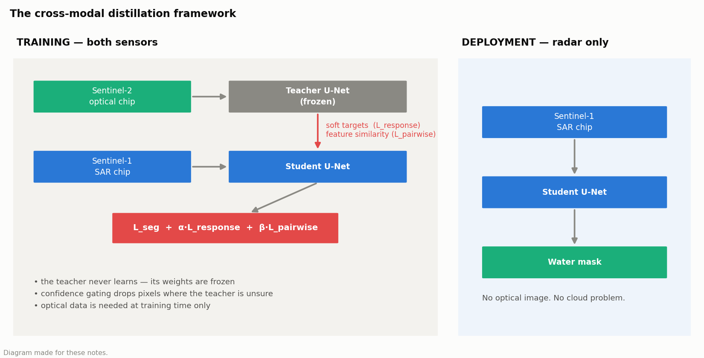
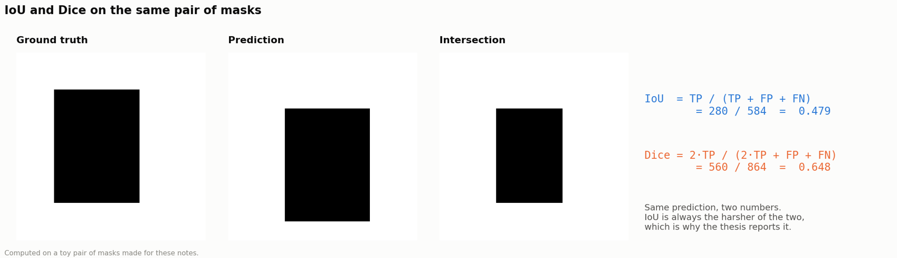
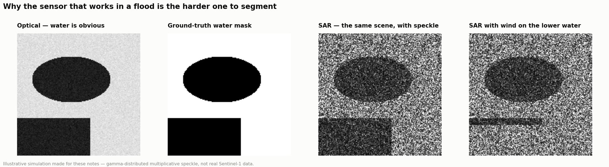
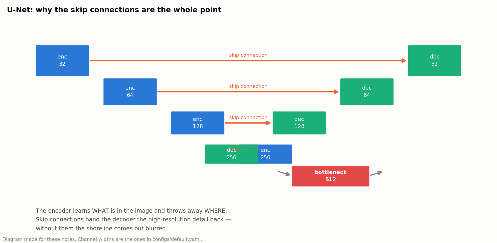
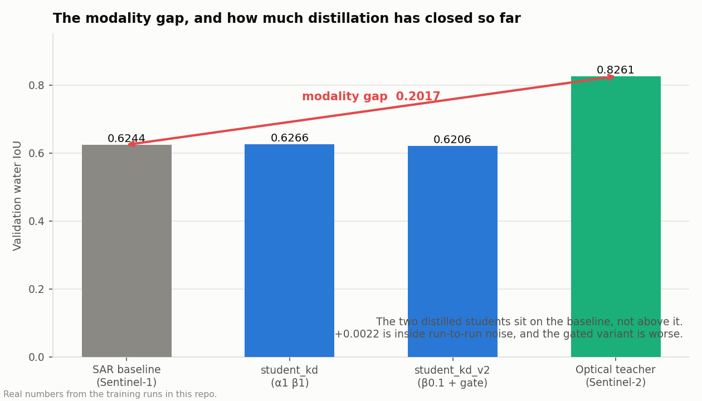

# 01 · Flood Segmentation with Cross-Modal Knowledge Distillation (Master's Thesis)

> **MAXU 5214 · Master's thesis · individual · July 2026 – present**
> Faculty of Artificial Intelligence and Cyber Security, UTeM
> Research repo: [github.com/imanfirdaus27/floodkd](https://github.com/imanfirdaus27/floodkd)

## 1 · Why this project exists

Floods and clouds arrive together. That one sentence is the whole thesis.

**Sentinel-2 (optical)** maps water accurately — water is dark and distinctive in the visible and
near-infrared bands. But optical sensors see nothing through cloud, and cloud is exactly the
weather a flood brings. The satellite that is good at the job is blind when you need it.

**Sentinel-1 (SAR)** sees through cloud, day or night, because radar is not light. But water in
radar is far harder to segment: **speckle** noise, look-angle effects, and wind roughening the
surface so it stops looking like water at all. Worse, hand-labelled SAR is scarce, because
labelling it is slow and needs expertise most annotators do not have.

**So the sensor that works during the disaster is the one with the weakest model.** Closing that
gap is the problem.

## 2 · The idea

Train the optical model as a **teacher**, distil what it knows into a **SAR-only student**, and
deploy the student alone. The optical image is only ever needed at *training* time, on archive
scenes where the sky happened to be clear.

```text
TRAINING                                      DEPLOYMENT
  Sentinel-2 (optical)  ──► Teacher U-Net           Sentinel-1 (SAR)
                              │  frozen                     │
                      soft targets + feature                ▼
                       similarity structure           Student U-Net
                              │                             │
  Sentinel-1 (SAR)  ────► Student U-Net                     ▼
                              │                       water mask
                              ▼                    (no optical needed)
                      L_seg + α·L_response + β·L_pairwise
```

---



*The whole framework on one page. The optical branch exists only on the left; at deployment the student runs on radar alone, and that is enforced by the architecture rather than promised in prose.*

## 3 · The concepts behind this thesis

### 3.1 Semantic segmentation, and how it is scored

Classification says "this image contains water". **Segmentation labels every pixel** — water or
land — so the output is a mask the same size as the input.

Two metrics, and the difference matters:

```text
IoU (Jaccard) = TP / (TP + FP + FN)          intersection over union
Dice (F1)     = 2·TP / (2·TP + FP + FN)      harmonic mean of precision and recall
```

Both ignore true negatives entirely, which is why they are used instead of accuracy: in a chip
that is 95% land, pixel accuracy is 95% for a model that predicts "no water anywhere". IoU is
stricter than Dice for the same prediction — it penalises errors more heavily — so IoU is the
number reported here.



*The two metrics computed on one pair of masks. Same prediction, two numbers — IoU is always the harsher of the two, which is why it is the one reported here.*

### 3.2 SAR vs optical — why one is harder

| | Sentinel-2 (optical) | Sentinel-1 (SAR) |
|---|---|---|
| What it measures | reflected sunlight, 13 spectral bands | backscattered radar energy, 2 polarisations |
| Sees through cloud | **no** | **yes** |
| Works at night | no | yes |
| Water signature | dark and distinctive, especially in NIR | low backscatter — usually |
| Main nuisance | cloud and cloud shadow | **speckle**, look angle, wind |
| Labelled data | plentiful | scarce |

**Speckle** is the key SAR concept. Radar is coherent, so returns from many scatterers inside one
pixel interfere constructively and destructively. The result is a grainy salt-and-pepper texture
that is *not* sensor noise in the usual sense — it is physics, and it does not average out by
taking a better picture.

**Why wind matters:** calm water is a mirror for radar, reflecting energy away from the sensor, so
it appears dark. Roughen that surface with wind and it starts scattering energy back — and the
flood looks like land.



*The same scene in both sensors. Optical: water is obviously dark. SAR: the same water buried in speckle. Right-hand panel: wind roughening the lower water body so it stops looking like water at all. This is the problem the thesis exists to close.*

### 3.3 U-Net and why skip connections exist

U-Net is an encoder–decoder built for segmentation:

- The **encoder** downsamples repeatedly, building up *what* is in the image while losing *where*.
- The **decoder** upsamples back to full resolution.
- **Skip connections** carry the high-resolution feature maps from each encoder level straight
  across to the matching decoder level.

Without the skips, the decoder has to reconstruct a precise boundary from a heavily downsampled
representation, and the shoreline comes out blurred and blobby. The skips hand it the fine detail
directly. **That is the entire reason U-Net beats a plain encoder–decoder on segmentation.**

The **bottleneck** — the deepest, most compressed layer — holds the most semantic, least spatial
representation. That is why it is the layer the pair-wise distillation compares (3.5).



*The skip connections carry high-resolution detail straight across from encoder to decoder. Without them the decoder has to invent the shoreline from a heavily compressed representation, and it comes out blurred.*

### 3.4 Knowledge distillation

Distillation trains a **student** to imitate a **teacher**. The original motivation (Hinton et al.)
was compression: a small model learning from a big one.

The insight is that a teacher's **soft output** carries more information than the hard label. If
the teacher says 0.7 water / 0.3 land on a pixel, it has told the student "this is water, but it
is an ambiguous pixel" — information the hard label `water` throws away. That extra signal is
sometimes called **dark knowledge**.

**Temperature** controls how much of it you see:

```text
softmax_T(z)_i = exp(z_i / T) / sum_j exp(z_j / T)
```

`T = 1` is the normal softmax. Raising `T` flattens the distribution, exposing the relative
confidence between classes. The KD loss is then multiplied by `T²`, because dividing the logits
by `T` shrinks the gradients by `1/T²` and this restores their scale.

**Cross-modal distillation** — what this thesis does — is a different use of the same machinery.
Teacher and student are the same size. What transfers is not capacity but **modality**: knowledge
learned from optical data, moved into a model that will only ever see radar.

### 3.5 The three families of distillation

| Family | What is matched | Strength | Weakness |
|---|---|---|---|
| **Response-based** | the output logits | simple, well understood | per-pixel; ignores spatial structure |
| **Feature-based** | intermediate activations directly | richer signal | requires matching shapes and scales |
| **Relation-based** | *relationships between* features — e.g. a similarity matrix | transfers structure, shape-agnostic | more expensive to compute |

This matters because **segmentation is a structured prediction problem.** Liu et al. (2019)
showed that per-pixel distillation alone is not enough: getting each pixel roughly right does not
guarantee a coherent shape. So the framework here uses response KD as the control condition and
adds **pair-wise (relation-based) KD** as the thing under test.

The pair-wise idea in one sentence: rather than "does the student produce the same value as the
teacher at this location", ask **"does the student think these two regions look alike, as much as
the teacher does"**. Relationships transfer structure in a way point-wise values do not.

### 3.6 Class imbalance in segmentation: why Dice joins cross-entropy

Water is the rare class. Plain cross-entropy is perfectly content to call everything land and
still score well, because it averages over pixels and land pixels vastly outnumber water ones.

**Dice loss** measures the *overlap* of the predicted and true water shapes and never counts true
negatives, so the sea of correct land pixels cannot drown out the error on the water. Combining
the two — `L_seg = CE + Dice`, with a class weight on water — gives you a loss whose gradient
still behaves well early in training (CE) and which cares about the rare class (Dice).

### 3.7 The ignore index

Sen1Floods11 labels no-data and cloud-shadow pixels as `-1`. These are pixels nobody knows the
answer for.

They must be excluded from **both** the loss and the metrics. Include them in the loss and you
train the model on labels that are meaningless. Include them in the metric and — depending which
way you count them — a true IoU of 0.40 can read as 0.25. **Wrong, and with no error message.**
That is why the masking lives in exactly one place in this codebase.

### 3.8 Data leakage from correlated samples

Chips from a single flood event share the same terrain, the same sensor geometry, the same
weather. They are not independent samples.

Split them randomly and near-identical chips land in both train and test, so the model can
effectively memorise. The reported number then measures memorisation rather than generalisation,
and it will be badly optimistic.

The fix is to **split by event, not by chip** — which is why this project uses the published split
CSVs and keeps **Bolivia** aside entirely as a held-out event. That gives one number at the end
that means "performance on a flood the model has never seen".

### 3.9 Self-supervised learning — the thesis's actual novelty

Supervised learning needs labels. **Self-supervised** learning invents a task from the data
itself — predict a masked patch, or pull two augmented views of the same image together in
embedding space while pushing different images apart (contrastive learning) — and learns a useful
representation with no labels at all.

Why it belongs here: labelled SAR is scarce (3.2) but *unlabelled* Sentinel-1/Sentinel-2 imagery
is essentially unlimited. A self-supervised teacher could learn from that unlimited pool, then
distil into the student. That is the contribution the thesis is building toward; the current
supervised teacher is the honest baseline it has to beat.

---

## 4 · Data — Sen1Floods11

Paired Sentinel-1 / Sentinel-2 chips with hand labels, published on Google Cloud Storage. Only
the 446 hand-labelled chips are wired up so far; the much larger weakly-labelled set is what the
self-supervised stage will need later.

| Label value | Meaning | Handling |
|---|---|---|
| `-1` | no data / cloud shadow | **ignored everywhere** — loss and metrics (3.7) |
| `0` | land | negative class |
| `1` | water | positive class, and the rare one (3.6) |

Normalisation constants come from the **sensors**, not from the batch: Sentinel-1 is in dB, real
values roughly in `[-50, 1]`; Sentinel-2 L1C is top-of-atmosphere reflectance scaled by 10,000.

Using fixed physical constants rather than batch statistics means a chip normalises identically
whether it is processed alone or in a batch of 64 — which matters at inference time, when there
is no batch.

```python
GCS = 'https://storage.googleapis.com/sen1floods11/v1.1'
SPLITS = {
    'train':   'flood_train_data.csv',
    'val':     'flood_valid_data.csv',
    'test':    'flood_test_data.csv',
    'bolivia': 'flood_bolivia_data.csv',   # held-out event, never train on this
}

S1_MIN, S1_MAX = -50.0, 1.0     # Sentinel-1 dB range
S2_SCALE = 10000.0              # Sentinel-2 TOA reflectance scaling
IGNORE_INDEX = -1
```

**Official splits, never random ones** — this is 3.8 made operational.

## 5 · How a run is actually done

One entry point, `run.py`, with six stages. Every number lives in `configs/default.yaml`; the code
contains no magic numbers.

```bash
python run.py explore                                   # 1. look at one chip first
python run.py download --split train,val,test           # 2. fetch the chips
python run.py stats --split train                       # 3. water / land / no-data balance
python run.py train --modality s1 --out-dir runs/base_s1      # 4a. SAR baseline
python run.py train --modality s2 --out-dir runs/teacher_s2   # 4b. optical teacher
python run.py distill --teacher-ckpt runs/teacher_s2/best.pt  # 5. the framework
python run.py eval --ckpt runs/distill/best.pt --split test --modality s1   # 6. once
```

```yaml
# configs/default.yaml — the whole experiment surface
modality: s1          # s1 | s2 | both
width: 32             # U-Net base width (16 if GPU memory is tight)
depth: 4
epochs: 30
lr: 0.001
dice_weight: 0.5
class_weights: [1.0, 5.0]    # water is rare, so weight it up
alpha: 1.0            # response KD weight   (0 = ablate)
beta: 1.0             # pair-wise KD weight  (0 = ablate)
temperature: 4.0
gate_threshold: 0.0   # 0 = no confidence gating; 0.7 turns it on
seed: 42
```

**Order matters.** The two baselines come before the framework, because "our method gets 0.62 IoU"
means nothing without the number it has to beat (the SAR baseline) and the number it is chasing
(the optical teacher). The distance between those two is the **modality gap**, and it is the
quantity the whole thesis is trying to shrink.

## 6 · The model

One U-Net used three ways — 2 input channels for SAR, 13 for optical, everything else identical.
That identity is what makes the three runs comparable: any difference in result is the modality,
not the architecture.

```python
class UNet(nn.Module):
    def __init__(self, in_channels, num_classes=2, width=32, depth=4):
        super().__init__()
        chans = [width * (2 ** i) for i in range(depth + 1)]   # 32 64 128 256 512
        self.encoders = nn.ModuleList()
        c_prev = in_channels
        for c in chans[:-1]:
            self.encoders.append(conv_block(c_prev, c))
            c_prev = c
        self.pool = nn.MaxPool2d(2)
        self.bottleneck = conv_block(chans[-2], chans[-1])     # compared by pair-wise KD
        ...
        self.head = nn.Conv2d(chans[0], num_classes, 1)

    def forward(self, x, return_features=False):
        skips = []
        for enc in self.encoders:
            x = enc(x); skips.append(x); x = self.pool(x)
        x = self.bottleneck(x)
        feat = x                                   # what distillation compares
        for up, dec, skip in zip(self.ups, self.decoders, reversed(skips)):
            x = up(x)
            if x.shape[-2:] != skip.shape[-2:]:
                x = F.interpolate(x, size=skip.shape[-2:], mode='bilinear', align_corners=False)
            x = dec(torch.cat([x, skip], dim=1))   # skip connection keeps the shoreline sharp
        logits = self.head(x)
        return (logits, feat) if return_features else logits
```

The `torch.cat([x, skip], dim=1)` line is 3.3 in code: the decoder is handed the encoder's
high-resolution features rather than having to invent them.

The wrapper is where the deployment claim is made **structural rather than rhetorical**:

```python
class TeacherStudent(nn.Module):
    def __init__(self, teacher, student, freeze_teacher=True):
        super().__init__()
        self.teacher, self.student = teacher, student
        if freeze_teacher:
            for p in self.teacher.parameters():
                p.requires_grad_(False)    # the teacher gives opinions, never learns
            self.teacher.eval()            # also freezes its batch-norm statistics

    def forward(self, s1, s2=None):
        s_logits, s_feat = self.student(s1, return_features=True)
        if s2 is None:
            return s_logits, s_feat, None, None      # inference path: SAR only
        with torch.no_grad():
            t_logits, t_feat = self.teacher(s2, return_features=True)
        return s_logits, s_feat, t_logits, t_feat

    @torch.no_grad()
    def predict(self, s1):
        return self.student(s1)            # what you would call in the field
```

`self.teacher.eval()` is not cosmetic. In `train()` mode batch-norm updates its running
statistics, so a "frozen" teacher would still be drifting — and any improvement could be
attributed to that rather than to the transfer.

## 7 · The loss, term by term

**L = L_seg + α · L_response + β · L_pairwise**

### L_seg — cross-entropy + Dice, class-weighted

The reasoning is 3.6.

```python
class DiceLoss(nn.Module):
    def forward(self, logits, target):
        valid = (target != IGNORE_INDEX).float()
        prob = logits.softmax(1)[:, self.positive]
        tgt = (target == self.positive).float()
        prob, tgt = prob * valid, tgt * valid            # unlabelled pixels zeroed
        inter = (prob * tgt).sum(dim=(1, 2))
        denom = prob.sum(dim=(1, 2)) + tgt.sum(dim=(1, 2))
        return (1 - (2 * inter + self.eps) / (denom + self.eps)).mean()
```

Note `prob` is the **soft** probability, not a thresholded mask — that keeps the loss
differentiable. The `eps` prevents division by zero on a chip with no water at all.

### L_response — Hinton-style KD on the logits

The control condition (3.4, 3.5).

```python
class ResponseKD(nn.Module):
    def forward(self, student_logits, teacher_logits, target=None):
        s = F.log_softmax(student_logits / self.t, dim=1)
        t = F.softmax(teacher_logits / self.t, dim=1)
        kl = F.kl_div(s, t, reduction='none').sum(1)
        if target is not None:
            valid = (target != IGNORE_INDEX).float()
            kl = kl * valid
            return (kl.sum() / valid.sum().clamp(min=1)) * (self.t ** 2)
        return kl.mean() * (self.t ** 2)
```

The `* (self.t ** 2)` is the gradient-rescaling from 3.4. KL divergence measures how far the
student's distribution is from the teacher's — asymmetric on purpose, since the teacher is the
reference.

### L_pairwise — structure, not probabilities

The relation-based term from 3.5, and the part under test.

```python
class PairwiseKD(nn.Module):
    @staticmethod
    def _similarity(feat):
        b, c, h, w = feat.shape
        f = F.normalize(feat.reshape(b, c, h * w), dim=1)   # direction, not magnitude
        return torch.bmm(f.transpose(1, 2), f)              # every region vs every region

    def forward(self, student_feat, teacher_feat):
        # 16×16 pooling = 256 regions = 65,536 pairs.
        # Unpooled 512×512 would be 68 billion — the pooling is not optional.
        s = F.adaptive_avg_pool2d(student_feat, self.pool)
        t = F.adaptive_avg_pool2d(teacher_feat, self.pool)
        return F.mse_loss(self._similarity(s), self._similarity(t))
```

`F.normalize` first means the dot product becomes a **cosine similarity** — it compares the
*direction* of two feature vectors, not their magnitude. That is what makes the comparison about
"do these regions look alike" rather than "are these activations equally strong", and it is why
the term transfers structure across two completely different sensors.

The pooling comment is not a footnote: a similarity matrix is quadratic in the number of regions,
so the size of the pool is the difference between a tractable loss and an impossible one.

### Confidence gating — do not copy a teacher who is guessing

An optical teacher looking at a partly clouded scene is unreliable in places. Where its max
softmax probability falls below the threshold, the pixel is marked as no-data for the
distillation term, so bad supervision does not propagate.

```python
class ConfidenceGate(nn.Module):
    def forward(self, teacher_logits):
        conf = teacher_logits.softmax(1).max(1).values
        return (conf >= self.threshold).float()
```

This is a direct consequence of 3.4: soft targets are only valuable when the teacher's confidence
is meaningful. An unconfident teacher's soft target is just noise wearing a useful shape.

## 8 · Results so far

| Run | Validation water IoU | Note |
|---|---|---|
| Sentinel-1 SAR baseline | **0.6244** | what the framework must beat |
| Sentinel-2 optical teacher | **0.8261** | best epoch 23 |
| **Modality gap** | **0.2017** | the target for cross-modal transfer |
| `student_kd` (α 1.0, β 1.0, no gate) | 0.6266 | epoch 29, +0.0022 over baseline |
| `student_kd_v2` (β 0.1 + gate 0.7) | 0.6206 | epoch 29, below baseline |

Read honestly: **the distillation has not moved the needle yet.** The framework, the losses and
the plumbing all work; the transfer does not, at these settings. +0.0022 is inside run-to-run
noise, and the gated variant is actually worse.

That is the real state of the project, and the next experiments are aimed at it: the
self-supervised teacher (3.9), data augmentation, and a proper sweep of α, β and the gate
threshold rather than three hand-picked runs.



*The real numbers from the runs in this repo. The two distilled students sit on the baseline, not above it — and the 0.2017 gap to the optical teacher is still entirely open. This is the chart the next round of experiments has to change.*

## 9 · Ablations the config makes free

| Run | Command |
|---|---|
| No distillation (baseline) | `train --modality s1` |
| Response KD only | `distill --alpha 1 --beta 0` |
| Pair-wise KD only | `distill --alpha 0 --beta 1` |
| Both | `distill --alpha 1 --beta 1` |
| Both + confidence gating | `distill --alpha 1 --beta 1 --gate-threshold 0.7` |

An **ablation** removes one component to see how much it was contributing. Setting α or β to zero
turns a loss term off without touching the code, which is why they are config values rather than
constants. Each run writes its own `runs/<name>/log.csv` and `config.json`, so months later the
ablation table can be rebuilt from disk instead of memory.

## 10 · Engineering decisions I would defend in a viva

- **The ignore mask lives in exactly one place.** `metrics.py` masks once, `losses.py` passes
  `ignore_index=-1`, nothing else touches it (3.7).
- **The teacher is frozen**, so any improvement is attributable to the transfer, not to a second
  model quietly learning.
- **Inference takes one modality.** `predict()` accepts S1 only; the architecture makes the
  deployment claim true by construction rather than by promise.
- **Seeds fixed, configs saved, best checkpoint chosen on validation water IoU** — not on loss,
  because loss is dominated by the land class (3.6).
- **`src/` never prints and never decides.** All I/O and control flow live in `run.py`, so the
  modules stay usable from a notebook when the Chapter 4 figures need rebuilding.

## 11 · What is deliberately not done yet

**Self-supervised pre-training of the teacher** — the actual novelty of the thesis (3.9). Right
now the teacher is trained supervised on Sentinel-2, which is the honest baseline; the contrastive
pretext task belongs in Chapter 3 once the pretext is chosen. Also pending: data augmentation (the
`transform` hook exists but is unused) and wiring up the weakly-labelled split.

## 12 · How this connects to the other projects

- The class-imbalance argument in 3.6 is the same one as
  [03 · E-commerce](../03-ecommerce-purchase-prediction) and
  [02 · MVTec](../02-mvtec-industrial-defect-ml): the majority class swamps the average, and you
  have to choose a metric that cannot be gamed by ignoring the rare class.
- The leakage argument in 3.8 is the same as the time-based-holdout point in
  [04 · Airbnb](../04-airbnb-price-occupancy-knime). In both cases a random split lets correlated
  samples appear on both sides and inflates the score.

## Files

```text
run.py                   explore | download | stats | train | distill | eval
configs/default.yaml     every number
src/config.py            loads YAML, applies CLI overrides, rejects typos
src/data.py              split CSVs, chip download, Dataset, normalisation
src/models.py            U-Net + TeacherStudent
src/losses.py            segmentation + the three distillation losses
src/metrics.py           IoU / F1 / precision / recall, mask applied once
src/engine.py            train + eval loops, checkpoints, CSV logging, seeding
docs/original-README.md  the working README from the research repo
```
