# 02 · Industrial Defect ML System — MVTec AD (PySpark, CNN, DQN, Compression)

> **MAXD 5143 Applied Machine Learning · Project · Group 3 · submitted 29 June 2026**
> Group: Syafiqah Amira binti Abdul Aziz, **Muhammad Iman Firdaus bin Md Rostan**,
> Zulkifli bin Md Nasir, Hanis binti Hussin
> Instructors: Dr. Khaled Cesar Al-Saih, Ts. Dr. Muhammad Noorazlan Shah bin Zainudin

## 1 · Why this project exists

The brief was "Advanced Industrial ML Systems", and the point of it was to stop us building a
model in a vacuum.

Picture a real factory line. A camera photographs every metal nut coming past. Somebody has to
get those images off disk fast enough to keep up with the belt, decide which parts are defective,
send a robot to the defective ones, and then squeeze the model small enough to run on the little
box bolted next to the camera — because sending every frame to a server is not happening.

That is four different engineering problems, and a model that is excellent at one of them can
still be useless on the line. So the project is graded as four sections, each with a theory half
and an implementation half. **The interesting part is where they meet:** the defect coordinates
that Section B produces become the obstacles the Section C robot has to avoid.

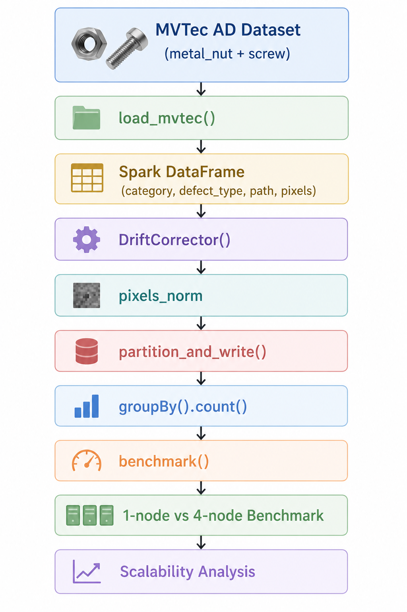

*Figure 2 — The whole stack on one page. Images come off disk into Spark, get drift-corrected,
feed the CNN classifier, the classifier's defect map feeds the RL agent, and the trained model
gets compressed for the edge device. Each arrow is a place the project could fall over, and two
of them did.*

---

## 2 · The concepts behind this project

Four different fields appear here. Each subsection explains the idea before the section that uses
it.

### 2.1 Distributed computing: why Spark exists

A single machine reading 5,000 images one at a time is limited by one CPU and one disk. Spark
splits the data into **partitions** and processes them on many executors at once.

The key data structure is the **RDD** (Resilient Distributed Dataset), which carries four things:
its parent dependencies, a compute function, partitioning information, and location hints. Those
four facts together are its **lineage** — the recipe for rebuilding it. When a partition is lost
to a crashed node, Spark recomputes **only that partition** from lineage, rather than restarting
the job or reloading everything.

**Lazy evaluation:** `map` and `filter` do not execute. They build a plan — a DAG of stages.
Nothing runs until an **action** (`count()`, `collect()`, `write`) demands a result. That delay is
what lets Spark fuse consecutive operations into one pass, push filters down to the read, reuse
cached partitions, and skip work nobody asked for.

**Spark vs Hadoop MapReduce**, the comparison the brief asked for:

| Aspect | Hadoop MapReduce | Apache Spark |
|---|---|---|
| Intermediate state | materialised to HDFS after every Map/Reduce | held in JVM memory as RDD partitions |
| Scheduling unit | fixed two-stage Map → Reduce | DAG of arbitrary stages |
| Disk I/O per iteration | repeated HDFS read + write | cached in memory, minimal disk |
| Fault tolerance | re-execute the task, re-read blocks | recompute the lost partition from lineage |
| Iterative ML | poor | good |

The argument in one line: for *k* iterations MapReduce needs roughly **2k** HDFS read/write
operations; Spark needs **1 + k** memory passes, because the dataset is cached after the first
read. That is where the usual 10×–100× figure for iterative ML comes from.

### 2.2 Shuffles, partitioning and data skew

A **narrow transformation** (`map`, `filter`) needs only the partition it is looking at. A **wide
transformation** (`groupBy`, `join`, `repartition`) needs data from *other* partitions, which
forces a **shuffle** — every executor writes intermediate files and sends them over the network.
Shuffles are the single most expensive thing in Spark.

**Data skew** is the related problem: if you partition by a key whose values are unevenly
distributed, one partition ends up enormous and one executor does all the work while the rest sit
idle. The job then runs at the speed of its slowest task.

**Salting** is the fix used here: append a pseudo-random bucket number to the partition key, so a
single hot key is spread across *n* buckets. You keep the pruning benefit of partitioning while
evening out the load.

### 2.3 Amdahl's law — why 4 workers do not give 4× speed-up

If a fraction **s** of a job is inherently serial, the maximum speed-up with *N* workers is:

```text
Speedup(N) = 1 / ( s + (1 - s) / N )
```

As *N* → ∞, the speed-up ceiling is **1/s**. A job that is 20% serial can never go faster than
5×, no matter how many machines you buy.

In this pipeline the serial fraction is: listing the files, starting the JVM, and collecting the
final result. On top of that, **scheduling and communication overhead grows with every worker
added**, so the real curve bends further away from ideal than Amdahl alone predicts.

This is why the honest result is 1.97×, not 4× — and why being able to explain the gap is worth
more than hiding it.

### 2.4 Why convolutions, not dense layers

Flatten a 256×256×3 image into a 1,024-neuron dense layer and you need
(196,608 + 1) × 1,024 = **201,327,616 parameters** — and you have thrown away the fact that
neighbouring pixels belong together.

A convolution fixes both problems at once through two ideas:

- **Parameter sharing.** One small kernel (say 3×3) slides across the entire image. The same 9
  weights detect an edge wherever it appears, so the parameter count collapses from hundreds of
  millions to hundreds.
- **Local connectivity.** Each output depends only on a small neighbourhood, which matches how
  visual features actually work — a scratch is a local pattern, not a global one.

**Translation equivariance** falls out of this: move the defect and the feature map response
moves with it. A dense network would have to learn the defect separately at every position.

### 2.5 Padding, stride and pooling

- **Padding.** *Valid* padding shrinks the feature map every layer and discards the border
  (`(5−3)/1 + 1 = 3`). *Same* padding adds a border of zeros so the size is preserved — which
  matters here because defects often appear at the edges of a part.
- **Stride.** Stride 1 scans densely (32→30). Stride 2 skips every other position (32→15) —
  cheaper and a built-in downsample, but coarser.
- **Max pooling.** Takes the maximum in each 2×2 window, halving the spatial size. It keeps "was
  this feature present nearby?" and discards "exactly where", which buys a little translation
  invariance and a lot of compute.

### 2.6 Batch normalisation

As the layers below it learn, each layer's input distribution keeps shifting — **internal
covariate shift**. Batch norm normalises each mini-batch to zero mean and unit variance, then
applies a learnable scale and shift.

What you get: a larger usable learning rate, far less sensitivity to weight initialisation,
smoother training curves, and a mild regularising effect from the noise in the batch statistics.

### 2.7 Global average pooling — a deployment decision

Instead of flattening the final feature map into the classifier head, GAP averages each channel
down to a single number.

The consequences:

- the number of head parameters drops to (channels × classes), which reduces overfitting;
- and crucially, **the head no longer depends on the input resolution**. Swap the factory camera
  for one with a different sensor and the model still runs. A flatten would hard-code the image
  size into the weights.

### 2.8 Overfitting, and the two regularisers compared

**Overfitting** is when the model learns the training set's noise rather than its pattern:
training loss keeps falling while validation loss turns and rises. The gap between the two curves
is the diagnostic.

| Regulariser | Mechanism | Effect |
|---|---|---|
| **L2 / weight decay** | add λ·Σw² to the loss | pushes all weights toward zero; prefers many small weights over a few large ones |
| **Dropout** | randomly zero a fraction *p* of activations each training step | no neuron can rely on any other, so the network learns redundant representations |

Dropout is sometimes described as training an ensemble of subnetworks that share weights. That is
why it tends to help more on the accuracy number, while weight decay mostly stabilises the curve.

### 2.9 The optimisers

All three descend the gradient; they differ in how they choose the step.

| Optimiser | Step rule | Behaviour |
|---|---|---|
| **SGD + momentum** | accumulates a velocity from past gradients | smooth and stable, but slow through flat regions |
| **RMSprop** | divides the step by a running average of squared gradients | adapts per parameter, but can oscillate |
| **Adam** | momentum **and** RMSprop combined — first *and* second moment | fast, smooth, usually the safe default |

Adam wins here because the loss surface has filters that need large steps and filters that need
tiny ones, and a per-parameter adaptive step is exactly the right tool for that.

### 2.10 Why recall is the metric that matters on a production line

Four outcomes, and they do not cost the same:

| | Predicted good | Predicted defect |
|---|---|---|
| **Actually good** | correct | false alarm — costs one inspection |
| **Actually defect** | **missed defect — ships to the customer** | correct |

So **recall on the defect class** — of all the real defects, how many did we catch — is the number
that matters. Accuracy is dominated by the majority class and tells you almost nothing here.

Three standard fixes, in ascending order of effort: collect more defective samples, weight the
loss so a missed defect costs more than a false alarm, and tune the decision threshold on recall
rather than leaving it at 0.5.

### 2.11 Reinforcement learning: the MDP, Q-learning, and DQN

**Why RL and not a shortest-path algorithm.** If the world were deterministic, Dijkstra solves
this and you are done. But the robot sometimes slips sideways — transitions are **stochastic** —
so what you need is a **policy** that behaves sensibly whatever happens, not one precomputed path.

An **MDP** (Markov Decision Process) is the formal frame: states, actions, a transition
probability, and a reward. "Markov" means the future depends only on the current state, not the
history.

**Q-learning** learns Q(s, a) — the expected total future reward of taking action *a* in state *s*
and behaving well thereafter. The update is the Bellman equation:

```text
Q(s,a) <- Q(s,a) + alpha * [ r + gamma * max_a' Q(s',a') - Q(s,a) ]
```

γ (gamma) is the **discount factor**: how much a future reward is worth now. γ near 1 makes the
agent far-sighted; γ near 0 makes it greedy.

A **DQN** replaces the Q-table with a neural network, because a 15×15 grid with moving workers
has far too many states to tabulate. That introduces two instabilities, and two fixes:

- **Replay buffer.** Consecutive experiences are highly correlated, and neural networks assume
  i.i.d. samples. Store transitions in a circular buffer and train on random mini-batches.
- **Frozen target network.** If the target `r + γ·max Q(s',a')` uses the same network being
  updated, the target moves every step and training chases its own tail. Keep a frozen copy and
  sync it every *n* steps.

**Exploration vs exploitation** is the last piece. ε-greedy takes a random action with
probability ε and the best-known action otherwise, with ε decaying over training: explore early,
exploit later. Decay too fast and the agent commits to a bad policy; too slow and it never stops
wandering. That is precisely what the ε-decay sweep in Section C measures.

### 2.12 Quantisation and pruning

Edge devices have limited memory, no GPU, and a power budget. Two ways to shrink a model:

- **Quantisation** stores weights in INT8 instead of FP32 — 4× smaller in principle, and integer
  arithmetic is faster on most edge hardware. *Dynamic* quantisation converts weights at export
  and activations on the fly, so it needs no calibration data. *Static* quantisation calibrates on
  real samples and is usually more accurate, at the cost of needing that data.
- **Pruning** zeroes the least important weights. *Unstructured* L1 pruning zeroes the smallest
  individual weights; *structured* pruning removes whole channels or filters.

**The catch that this project actually ran into:** unstructured pruning sets weights to zero but
the tensor is still dense on disk. You get no size reduction unless the format stores sparsity
explicitly, and no speed-up unless the hardware skips zeros. Structured pruning is the one that
shrinks things — which is why Section D's size column does not move.

---

## 3 · The framework and the stack

| Section | Problem | What we used | Why that choice |
|---|---|---|---|
| **A** | Get images through fast | PySpark | iterative work needs data cached in memory, not written to disk every pass (2.1) |
| **B** | Classify defects | PyTorch CNN | convolution shares kernels and keeps spatial structure (2.4) |
| **C** | Route the robot | Deep Q-Network | transitions are stochastic, so you need a policy, not a shortest path (2.11) |
| **D** | Fit on the edge box | Quantisation + pruning | inference has to happen next to the camera (2.12) |

## 4 · The data, and the first thing we did with it

**MVTec AD**, an industrial anomaly-detection benchmark. Two categories:

| Category | Classes used |
|---|---|
| `metal_nut` | good, flip, bent, color |
| `screw` | good, manipulated_front, thread_top, scratch_head |

Before any modelling: **plot the data and look at it.** A grid of normal and defective samples per
category, to confirm the folder walk actually found what we thought it found. This takes ten
minutes and catches the class of bug that otherwise costs a day.

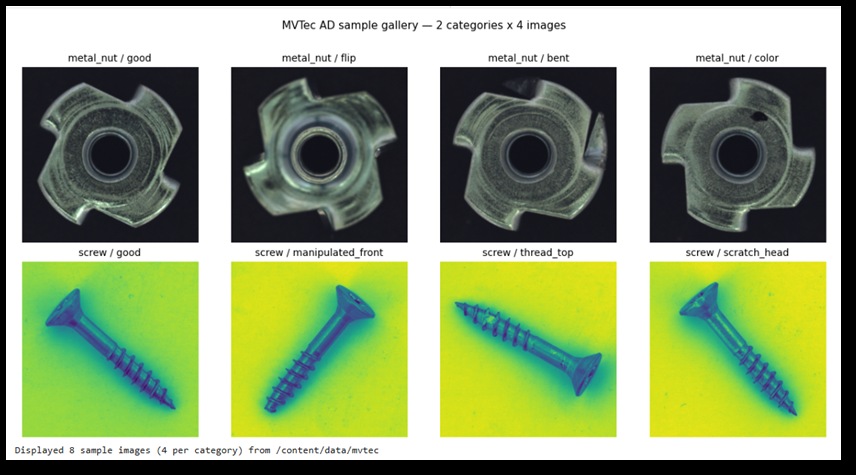

*Figure 1 — Sample gallery, normal beside defective. Look at how much the illumination, orientation
and defect appearance vary between shots of the same part. That variation is not noise to be
ignored — it is exactly what motivates the drift correction in the next section.*

---

# Section A · Distributed data pipeline

## A.1 Step 1 — Load images into a Spark DataFrame

Walk `category/split/defect_type/*.png`, build a three-column DataFrame with an **explicit
schema** (no type inference on a small sample), then read the bytes inside a UDF so decoding
happens **on the executors**, not the driver.

```python
def load_mvtec(spark, root):
    rows = []
    for cat in sorted(os.listdir(root)):
        cdir = Path(root) / cat
        if not cdir.is_dir():
            continue
        for split in ('train', 'test'):
            sd = cdir / split
            if not sd.exists():
                continue
            for dd in sd.iterdir():
                for ip in dd.glob('*.png'):
                    rows.append((cat, dd.name, str(ip)))

    schema = StructType([StructField('category', StringType()),
                         StructField('defect_type', StringType()),
                         StructField('path', StringType())])
    df = spark.createDataFrame(rows, schema)

    @psF.udf(returnType=ArrayType(IntegerType()))
    def _read(p):
        with open(p, 'rb') as fh:
            return _decode(fh.read())     # PNG bytes -> flat grayscale uint8 list

    return df.withColumn('pixels', _read(psF.col('path')))
```

The driver builds only the *paths*; the executors do the decoding. Decode on the driver and you
have a distributed system with a single-threaded bottleneck at the front.

## A.2 Step 2 — `DriftCorrector`, and why it exists

Factory lighting drifts. The camera ages. The same nut photographed on Monday and on Friday is
**not the same array of numbers**. Train on that and the model quietly learns the lighting instead
of the defect, then falls over the first time maintenance changes a bulb.

The transformer normalises every image to one fixed reference distribution in three moves: scale
to \[0,1\] → standardise per image → re-anchor to μ = 0.45, σ = 0.22.

```python
class DriftCorrector(Transformer, HasInputCol, HasOutputCol,
                     DefaultParamsReadable, DefaultParamsWritable):
    def __init__(self, inputCol='pixels', outputCol='pixels_norm',
                 ref_mean=0.45, ref_std=0.22):
        super().__init__()
        self._set(inputCol=inputCol, outputCol=outputCol)
        self.ref_mean, self.ref_std = ref_mean, ref_std

    def _transform(self, df):
        ref_mean, ref_std = self.ref_mean, self.ref_std   # locals, so the UDF pickles

        @psF.udf(returnType=ArrayType(FloatType()))
        def _norm(pixels):
            if pixels is None:
                return None
            a = np.asarray(pixels, dtype=np.float32) / 255.0
            mu, sd = a.mean(), a.std() + 1e-6
            a = (a - mu) / sd
            a = a * ref_std + ref_mean
            return a.astype(np.float32).tolist()

        return df.withColumn(self.getOutputCol(), _norm(psF.col(self.getInputCol())))
```

Two implementation details worth knowing:

- **Inheriting `Transformer`** rather than writing a plain function means it drops into a
  `Pipeline` like any built-in stage, and `DefaultParamsReadable/Writable` means it saves and
  loads with the rest of the pipeline. The preprocessing travels with the model, which is how you
  avoid training/serving skew.
- **The `ref_mean, ref_std = self.…` line** copies the values into local variables so the closure
  does not capture `self`. Spark pickles the UDF to ship it to executors; capturing `self` would
  try to pickle the whole transformer object.

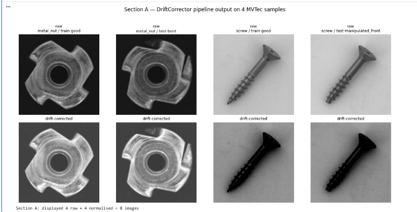

*Figure 3 — DriftCorrector, before and after. Contrast is up, the background is uniform across
shots, and — the bit that matters — the geometry is untouched. The defect is still exactly where
it was; only the exposure has been normalised away.*

## A.3 Step 3 — Partitioning that avoids a shuffle

```python
def partition_and_write(df, out_path, n_buckets=8):
    salted = df.withColumn(
        'salt', (psF.crc32(psF.concat_ws('_', 'category', 'defect_type')) % n_buckets))
    (salted.repartitionByRange(n_buckets, 'category', 'salt')
           .write.mode('overwrite').partitionBy('category').parquet(out_path))
```

This is 2.2 applied. `metal_nut/good` has far more images than `screw/scratch_head`, so
partitioning on category alone gives one executor the big bucket while the others idle. The salt
spreads each category across 8 buckets so the load is even **and** the category partitioning still
prunes on read.

## A.4 Step 4 — Benchmark, honestly

```python
def benchmark(spark, root):
    t0 = time.perf_counter()
    df = DriftCorrector().transform(load_mvtec(spark, root))
    n = df.groupBy('category', 'defect_type').count().agg({'count': 'sum'}).first()[0]
    return n, time.perf_counter() - t0
```

The `groupBy(...).count()` is there to force evaluation — without an **action**, lazy evaluation
(2.1) means nothing has actually run and you would be timing the construction of a plan.

| Configuration | Wall clock | Speed-up | Parallel efficiency |
|---|---|---|---|
| `local[1]` | 8.45 s | 1.00× | 1.00 |
| `local[4]` | 4.28 s | **1.97×** | 0.49 |
| `local[8]` | ~3 s | ~2.8× | **0.38** |

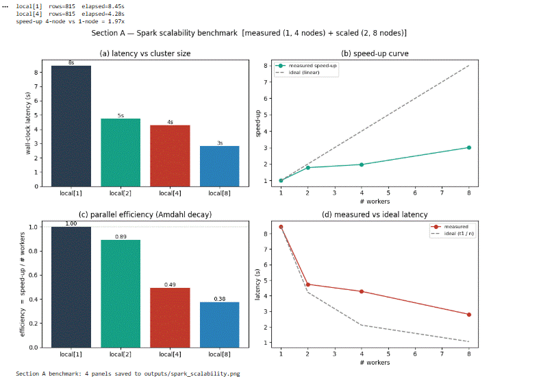

*Figure 4 — The scalability study: latency vs workers, measured vs ideal speed-up, parallel
efficiency, and measured vs ideal latency. The measured curve bends away from the ideal line, and
the report says why instead of hiding it — Amdahl's law (2.3) plus scheduling and communication
overhead that grows with every worker added. Past 4 workers you are paying for almost nothing:
efficiency has already dropped to 0.38.*

---

# Section B · CNN defect classifier

## B.1 The model, driven by one config dict

```python
CONFIG = {
    'img_size': 128, 'batch_size': 32, 'epochs': 25, 'lr': 1e-3,
    'activation': 'relu',          # relu | gelu | leaky_relu
    'kernel_size': 3,
    'channels': [32, 64, 128, 256],   # one entry per conv block
    'dropout_p': 0.3,
    'weight_decay': 1e-4,          # L2 regularisation strength
    'optimizer': 'adam',           # sgdm | rmsprop | adam
    'num_classes': 2,              # good vs defect
    'seed': 42,
}


class DefectCNN(nn.Module):
    """4-block CNN (Conv -> BN -> Act -> MaxPool) + GAP + FC head."""

    def __init__(self, cfg):
        super().__init__()
        k, in_ch, layers = cfg['kernel_size'], 3, []
        for out_ch in cfg['channels']:
            layers += [
                nn.Conv2d(in_ch, out_ch, k, padding=k // 2, bias=False),
                nn.BatchNorm2d(out_ch),
                _act(cfg['activation']),
                nn.MaxPool2d(2),
            ]
            in_ch = out_ch
        self.features = nn.Sequential(*layers)
        self.gap = nn.AdaptiveAvgPool2d(1)      # H×W -> 1×1 per channel
        self.dropout = nn.Dropout(cfg['dropout_p'])
        self.head = nn.Linear(in_ch, cfg['num_classes'])

    def forward(self, x):
        x = self.features(x)
        x = self.gap(x).flatten(1)
        x = self.dropout(x)
        return self.head(x)
```

Reading the architecture against section 2:

- **`padding=k // 2`** is same padding (2.5) — the feature map keeps its size through the conv, so
  edge defects are not discarded.
- **`bias=False` on the conv** because BatchNorm immediately after has its own shift parameter; a
  conv bias would be redundant.
- **Channels double while spatial size halves** (32→64→128→256, with a MaxPool each block). This
  is the standard shape: trade spatial resolution for feature richness as you go deeper.
- **GAP instead of flatten** — the deployment decision in 2.7.
- Everything driven from one dict, so the ablations below are a config change rather than a code
  change. That is what makes them comparable.

## B.2 Regularisation study

Three configurations, same seed, same data, same epochs.

| Setting | Val accuracy | Val loss | Overfitting gap | Convergence |
|---|---|---|---|---|
| L2 only (wd 1e-3, p 0) | 66.3% | ~0.57 | largest (epoch 4) | gradual |
| Dropout only (wd 0, p 0.5) | **69.9%** | ~0.52 | moderate | moderate |
| Combined (wd 1e-4, p 0.3) | 68.7% | **~0.48** | **smallest** | fastest |

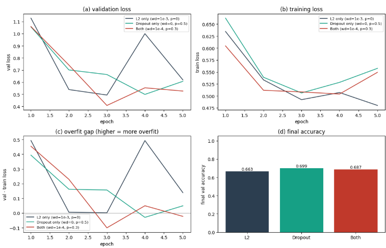

*Figure 5 — Read this as a trade, not a winner. Dropout alone gives the best headline accuracy;
the combination gives the lowest loss and the most stable curve. We took the combination, because
a stable curve is worth more than a point of accuracy you cannot reproduce — and the "overfitting
gap" column (2.8) is the reason.*

## B.3 Optimiser study

| Optimiser | Final val loss | Final val accuracy | Behaviour |
|---|---|---|---|
| SGD + momentum | 0.569 | 68.1% | gradual, stable |
| RMSprop | 0.717 | 59.5% | unstable, spiky |
| **Adam** | **0.527** | **68.7%** | fast and smooth |

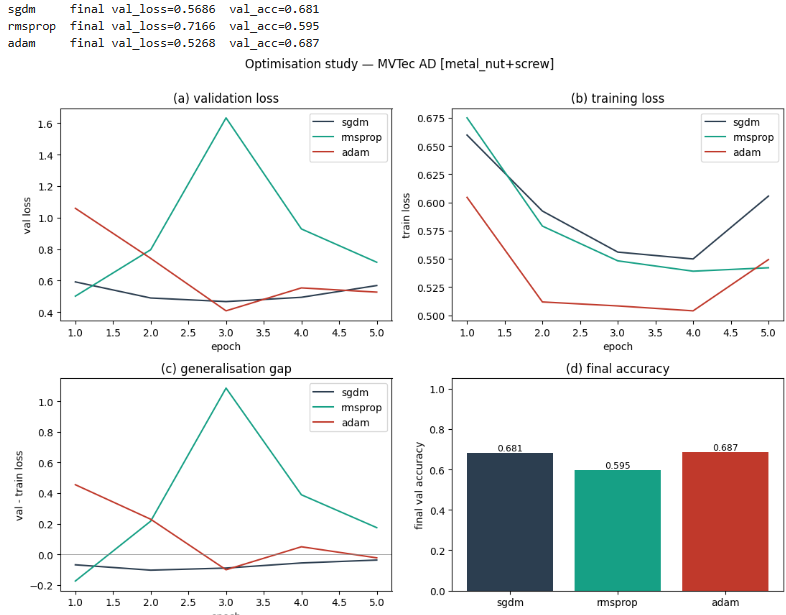

*Figure 6 — Adam wins for the reason in 2.9: a per-parameter step from both the first and second
moment of the gradients suits a loss surface where some filters need big steps and others need
small ones. RMSprop's spikiness is visible in the curve, not just in the final number — it adapts
the magnitude but has no momentum to smooth the direction.*

## B.4 Diagnostics — the part that actually matters

| Class | Precision | Recall | F1 |
|---|---|---|---|
| Good | 0.85 | 0.97 | 0.90 |
| **Defect** | 0.69 | **0.28** | 0.40 |
| Overall accuracy | | | **83%** |

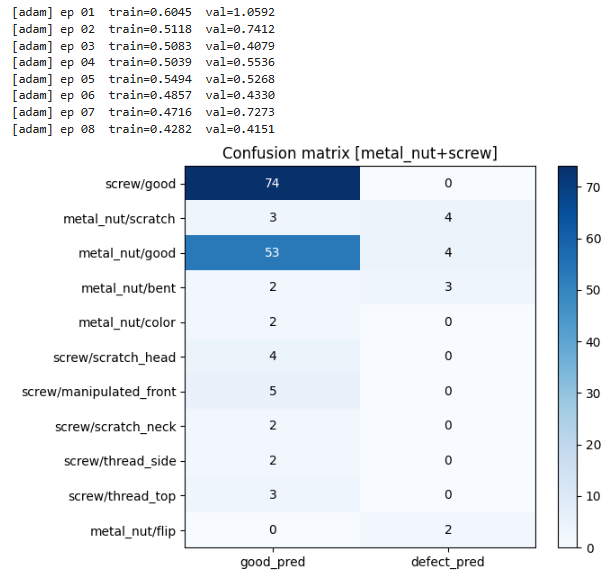

*Figure 7 — Confusion matrix, broken down by defect type. This is the figure that undoes the
headline. The model is good at saying "fine" and bad at catching faults — and by 2.10 that is the
wrong way round for a production line. 83% accuracy is mostly the majority class.*

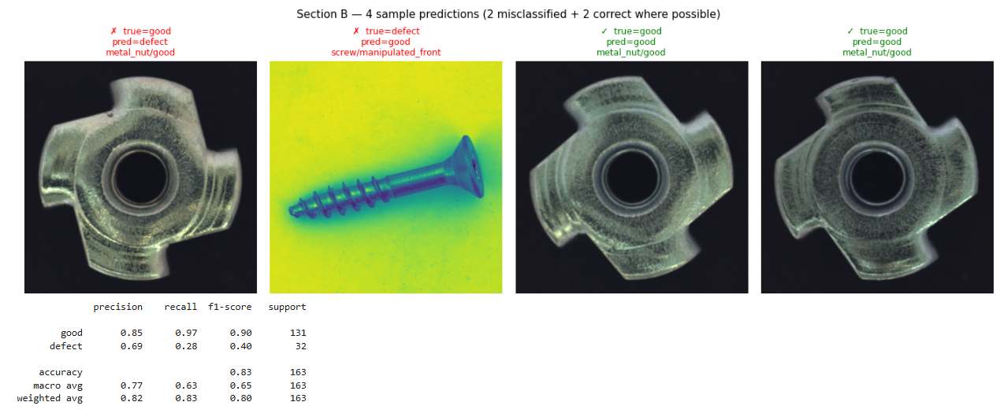

*Figure 8 — Sample predictions, predicted against true. Useful for seeing which defects get
missed: the subtle scratches and colour variations, not the obvious bends. That pattern points at
the fix — the model needs more examples of the low-contrast defect classes, not a bigger network.*

The three things that would fix it, in order of effort: more defective samples, class weighting in
the loss, and a decision threshold tuned on recall rather than accuracy (2.10).

---

# Section C · Autonomous path optimisation (DQN)

## C.1 The MDP formulation

Per 2.11: **state** = agent position, worker positions and defect cells on a 15×15 grid;
**actions** = up / down / left / right / stay; **reward** = **+100** reaching the goal, **−50**
collision, **−1** per step.

Each reward term is doing a job. +100 makes the goal worth reaching. −50 makes collisions worse
than delay. **−1 per step is the one people forget** — without a time penalty, an agent that
wanders forever and eventually arrives scores the same as one that goes straight there.

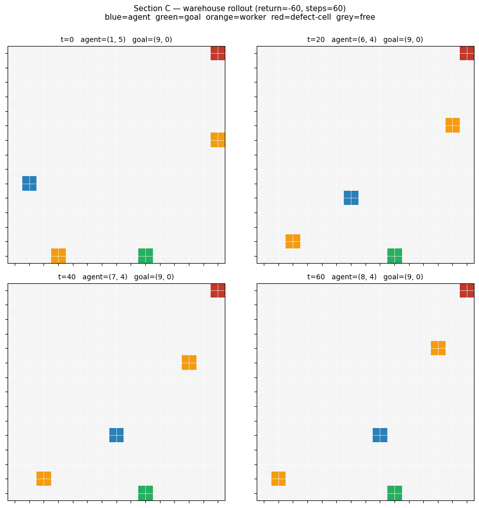

*Figure 10 — The simulated warehouse the agent runs in. The obstacles are not invented: they are
injected from the defect coordinates produced by Section B. That join is the reason the four
sections are one project rather than four assignments.*

## C.2 Implementation

Three classes, deliberately separated: `WarehouseEnv` (dynamics), `QNet` (a small MLP: obs → 256 →
256 → Q-values per action), `DQNAgent` (replay buffer, frozen target network, ε-greedy with
decay).

```python
ACTIONS = [(-1, 0), (1, 0), (0, -1), (0, 1), (0, 0)]   # N, S, W, E, stay

class DQNAgent:
    def __init__(self, obs_dim, n_actions, lr=1e-3, batch=64, buf=20000,
                 gamma=0.95, eps=1.0, eps_end=0.05, eps_decay=0.995, seed=0):
        self.q    = QNet(obs_dim, n_actions)
        self.tgt  = QNet(obs_dim, n_actions)
        self.tgt.load_state_dict(self.q.state_dict())   # frozen target copy
        self.opt  = torch.optim.Adam(self.q.parameters(), lr=lr)
        self.buf  = deque(maxlen=buf)                   # circular replay buffer
```

Every hyperparameter in that signature is one of the ideas in 2.11: `gamma=0.95` is the discount,
`eps` decaying from 1.0 to 0.05 is the exploration schedule, `buf=20000` is the replay buffer, and
the separate `self.tgt` is the frozen target. The separation into three classes is not tidiness —
it means the environment can be swapped for the real warehouse layout without touching the
learning code.

## C.3 Results, stated plainly

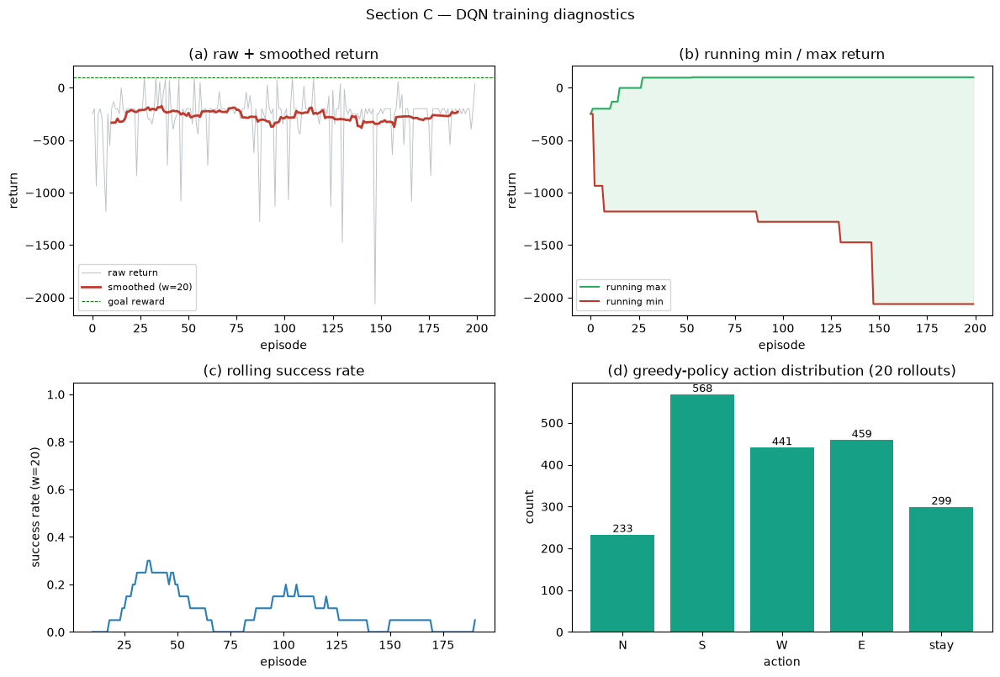

*Figure 9 — Training diagnostics: raw vs smoothed return, min/max envelope, rolling success rate,
and the greedy action distribution. Nothing here converges cleanly. The return wanders and the
success rate never settles — **the agent is not a usable navigator.** The action-distribution
panel is the most diagnostic: a healthy policy specialises, and this one has not.*

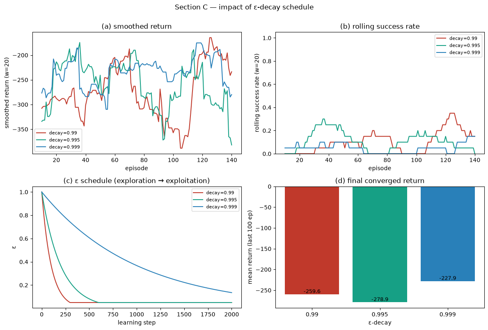

*Figure 11 — ε-decay sweep across three schedules. This is the constructive half of the failure:
it turns "it didn't work" into "here is which exploration schedule to retrain with", which is the
difference between an incomplete project and an honest one.*

Reporting this as a failure was the right call. **A policy that looks trained and is not is more
dangerous than one everybody knows is untrained** — especially when the thing it controls is a
robot moving around people.

---

# Section D · Edge deployment and compression

## D.1 Three variants, same validation set

```python
def quantise(model):
    """Dynamic INT8 on every Linear and Conv2d: weights mapped at export,
    activations quantised at runtime."""
    return tq.quantize_dynamic(model, {nn.Linear, nn.Conv2d}, dtype=torch.qint8)


def structural_prune(model, amount=0.3):
    """L1-unstructured: zero the smallest 30% of weights, then bake the mask in."""
    m = copy.deepcopy(model)
    for mod in m.modules():
        if isinstance(mod, (nn.Conv2d, nn.Linear)):
            prune.l1_unstructured(mod, name='weight', amount=amount)
            prune.remove(mod, 'weight')
    return m
```

| Variant | Size | Latency / image | Accuracy |
|---|---|---|---|
| FP32 | 1.57 MB | 50.04 ms | 0.942 |
| INT8 | 1.57 MB | **48.13 ms** | 0.942 |
| Pruned 30% + INT8 | 1.57 MB | 49.00 ms | 0.933 (**−0.9 pp**) |

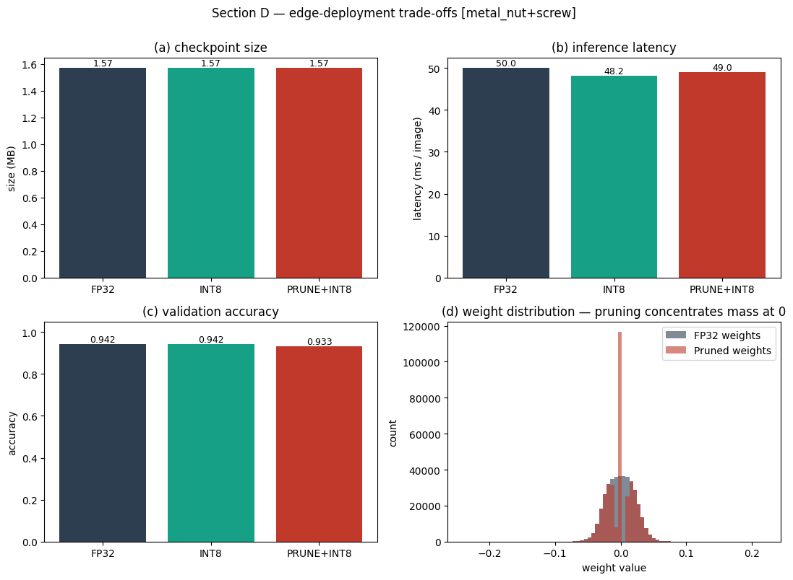

*Figure 12 — Compression trade-offs. Two findings. **Size did not move** — and 2.12 explains why:
`prune.remove` bakes the mask in but the tensor stays dense, so zeroed weights still occupy bytes.
Panel (d) shows the pruned weight spike sitting exactly at zero, so the pruning definitely
happened; it simply is not *stored* sparsely. **INT8 is the free one**: fastest, no calibration
data needed, no measurable accuracy cost. The pruning bought nothing here and cost 0.9 pp.*

Note the function is named `structural_prune` but calls `l1_unstructured` — that naming mismatch
is itself the lesson. Structured pruning is what would have shrunk the model.

## D.2 The ethics section, translated into factory units

On a line running 100,000 items a day, a 0.7 pp accuracy drop is roughly **700 extra misclassified
products daily**. Flagging a good part costs an inspection. Missing a bad one can cost
considerably more than money.

So compression is a **release decision, not a lab trick**, and it needs: version documentation,
per-build accuracy benchmarks, testing on the input regions where quantisation hurts most, and
production monitoring with alerts.

The transferable habit: **convert every percentage into the unit the business counts in.** "0.7
percentage points" survives a meeting. "700 defective products a day" does not.

---

## What I would say about this project in an interview

1. **The speed-up is 1.97×, not 4×** — and I can derive why from Amdahl's law and scheduling
   overhead rather than shrugging at it.
2. **The classifier's 83% hides a 0.28 defect recall.** I know that because the confusion matrix
   was part of the evaluation, and I know the three things I would change.
3. **The DQN does not work yet**, and the ε-decay study says which schedule to try next.
4. **Compression is a trade I can quantify** in units the factory cares about — misclassifications
   per day, not percentage points.

## How this connects to the other projects

- The representation argument in 2.4 is the image version of what
  [05 · IMDB](../05-imdb-sentiment-nlp) says about bag-of-words: know what your representation
  throws away. A dense layer throws away spatial structure; bag-of-words throws away order.
- The recall-over-accuracy argument in 2.10 is the same lesson as
  [03 · E-commerce](../03-ecommerce-purchase-prediction), arriving from manufacturing instead of
  marketing.

## Files

```text
notebook.ipynb              the submitted notebook (code + outputs)
code/mvtec_pipeline.py      code cells extracted, markdown kept as comments
figures/                    the 12 figures above, from the submitted report
```

Data: [MVTec AD](https://www.mvtec.com/company/research/datasets/mvtec-ad), `metal_nut` and
`screw`. Not in the repo — the notebook downloads and extracts into `data/mvtec/`.
