# E-Commerce Purchase Prediction & Customer Segmentation

**Applied Machine Learning (MAXD 5143), Assignment 2, UTeM · June 2026 · individual**

Case study "Global-Mart": a three-tier ML system - segment shoppers, predict who responds to
a high-value offer, and mine product associations.

## Task 1 - Behavioural segmentation
Synthetic customer set of 300 records (annual spend, visit frequency), standardised with
`StandardScaler`, then K-Means vs agglomerative hierarchical clustering.
- Silhouette peaked at **0.63 at k = 2**, and the elbow of the inertia curve agreed.
- **Complete linkage beat single linkage** (0.63 vs 0.59) and was far more robust to
  outliers - single linkage chains clusters together through nearby points.

## Task 2 - Purchase prediction
[UCI Online Shoppers Purchasing Intention](https://archive.ics.uci.edu/dataset/468/online+shoppers+purchasing+intention+dataset):
**12,330 sessions**, no missing values, target imbalanced at 84.53% non-buyers.

| Model | Accuracy | Recall | F1 |
|---|---|---|---|
| KNN (standardised) | **86.78%** | - | - |
| Decision Tree | 85.28% | 54.97% | 53.64% |
| Gaussian Naive Bayes | 77.94% | **67.28%** | - |

Accuracy alone is misleading on an 85/15 split, so precision, recall and F1 decide: KNN wins
on accuracy, the tree balances best, Naive Bayes catches the most buyers at the cost of
precision (38.02%).

## Task 3 - Ensembles
| Model | Accuracy | Precision | Recall | F1 |
|---|---|---|---|---|
| **Random Forest (bagging)** | **89.98%** | 73.20% | 55.76% | **63.30%** |
| AdaBoost (boosting) | 89.01% | - | - | - |
| Decision Tree (baseline) | 85.28% | - | - | 53.64% |

Bagging lifted accuracy **4.7 percentage points** over a single tree by averaging away its
variance; boosting attacked bias by re-weighting the examples earlier models got wrong.

## Files
```
notebook.ipynb                  the submitted notebook
code/ecommerce_models.py        code cells extracted, markdown kept as comments
```

## Figures

The 16 images below are the real figures from the MAXD 5143 Assignment 2 notebook, extracted from the submitted PDF.

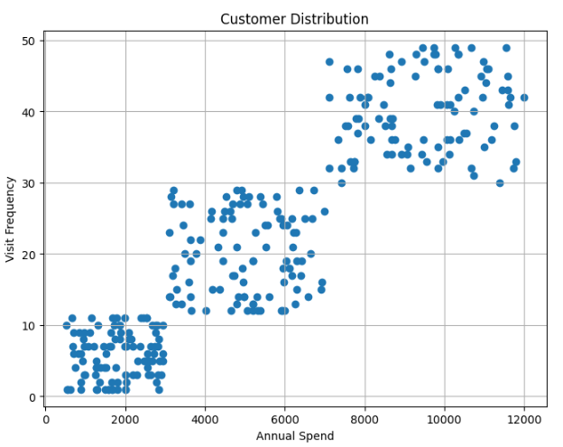

*Annual spend vs visit frequency, 300 synthetic customers.*

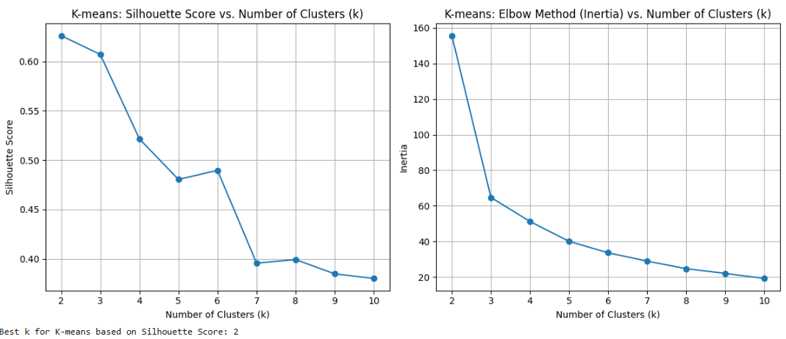

*K-Means silhouette and inertia elbow — both agree on k = 2 (0.63).*

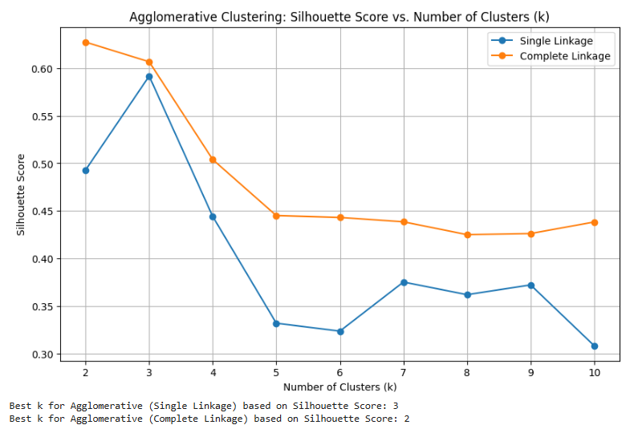

*Single vs complete linkage: 0.59 vs 0.63. Single linkage chains the groups together.*

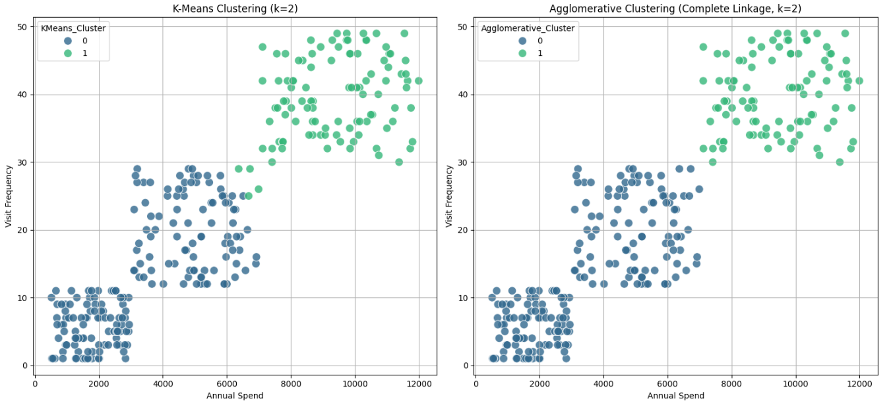

*Final cluster assignments, K-Means beside agglomerative complete linkage.*

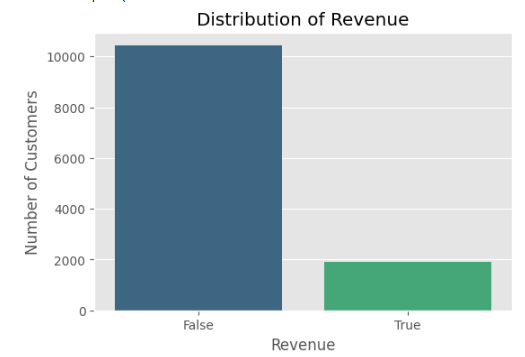

*84.53% of sessions do not buy — why recall and F1 are reported, not accuracy alone.*

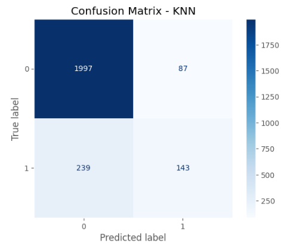

*K-Nearest Neighbour confusion matrix.*

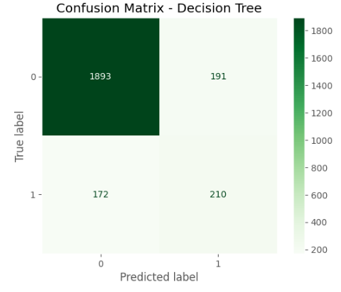

*Decision Tree confusion matrix — best buyer recall of the baselines.*

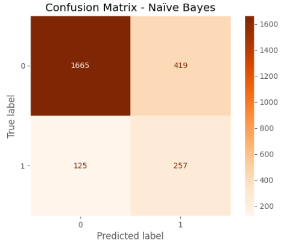

*Naïve Bayes confusion matrix — more buyers caught, 419 false positives.*

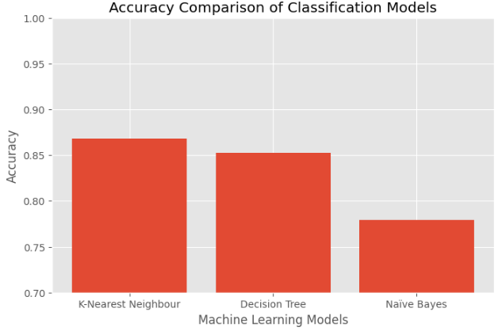

*Accuracy across the three baseline classifiers.*

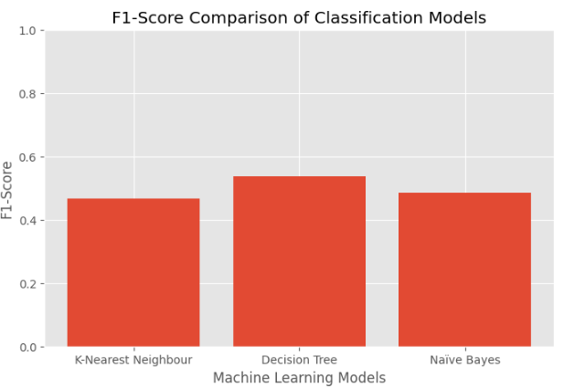

*F1 across the same three — the ranking flips.*

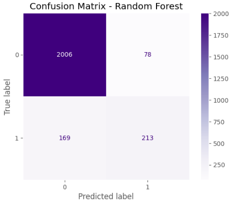

*Random Forest confusion matrix.*

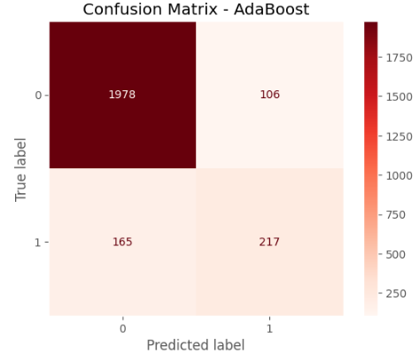

*AdaBoost confusion matrix.*

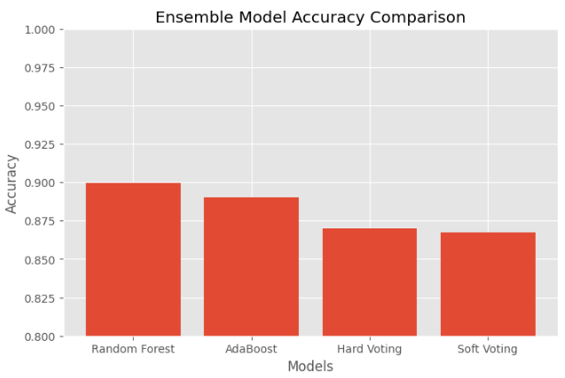

*Random Forest, AdaBoost, hard and soft voting side by side.*

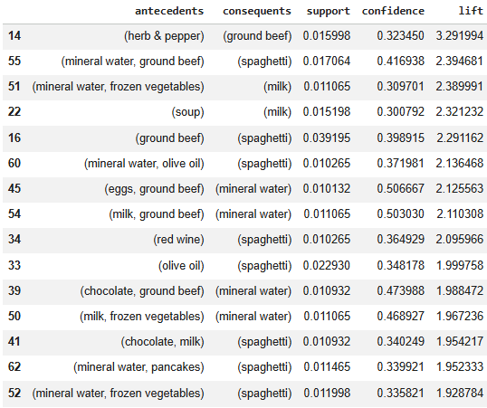

*Association rules ranked by lift, with support and confidence.*

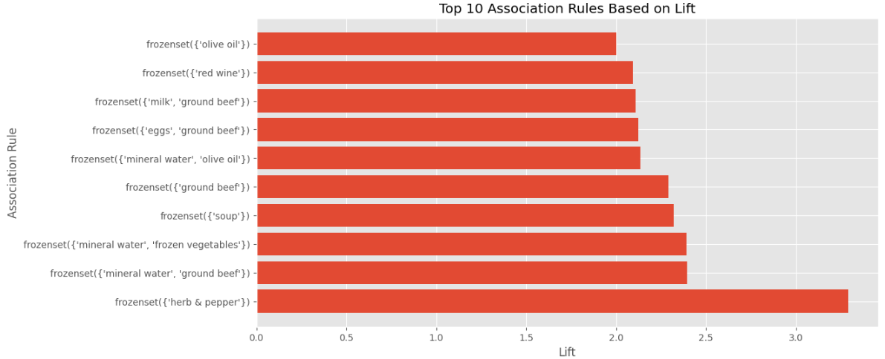

*Top 10 rules by lift — strongest is herb & pepper → ground beef (3.29).*

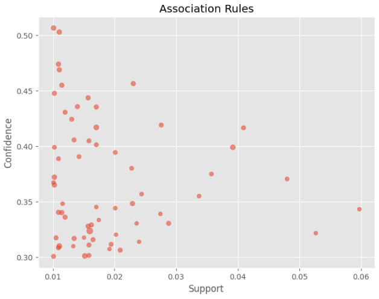

*Support vs confidence — nothing in the high-support, high-confidence corner.*
