# 04 · Airbnb Price & Occupancy Prediction, Singapore (KNIME + XGBoost)

> **MAXD 5113 Fundamental of Data Science · Project · group of 3 (Anis, Syahmi, Iman) · November 2025**

## 1 · Why this project exists

An Airbnb host sets a nightly price and then lives with the consequence. Price too high and the
calendar stays empty; too low and the calendar fills but the revenue does not. Airbnb's own
**Smart Pricing is a black box** — it moves your price without telling you what it is optimising,
or what that costs you in occupancy.

**The question we set:** what actually drives an Airbnb listing's price in Singapore, and how does
price relate to how full a listing stays?

**Objectives**

1. Analyse overall pricing and occupancy patterns in the Singapore market.
2. Identify which listing attributes drive price, and which drive occupancy — they may not be the
   same attributes.
3. Build a model for each, and package the output so a host could actually use it.

---

## 2 · The concepts behind this project

### 2.1 CRISP-DM — why a process framework at all

**CRISP-DM** (Cross-Industry Standard Process for Data Mining) is the six-phase loop most data
projects follow whether they admit it or not:

| Phase | The question it answers |
|---|---|
| Business understanding | what decision are we actually trying to improve? |
| Data understanding | what have we got, and how broken is it? |
| Data preparation | how do we get it into a state a model can use? |
| Modelling | which algorithm, and why that one? |
| Evaluation | does this answer the business question, not just score well? |
| Deployment | how does a real person use the output? |

The reason it matters here is the arrow back from Evaluation to Business Understanding. Our
evaluation found that price and occupancy are only weakly related, which changed the
recommendation from "here is your optimal price" to "here are the two market curves, pick one".
A project that skips straight to modelling never gets that feedback.

It also grades well because most of the marks are in the phases people skip.

### 2.2 Types of missing data, and why we did not impute review scores

Missingness comes in three flavours, and the right treatment depends on which one you have:

- **MCAR** (missing completely at random) — the missingness has nothing to do with anything.
  Dropping rows is safe.
- **MAR** (missing at random) — missingness depends on *other observed* variables. Imputation can
  work if you condition on those.
- **MNAR** (missing not at random) — missingness depends on the *missing value itself*.

Review scores are the textbook MNAR case: a listing has no review score largely because nobody
has stayed there, which is itself informative. Imputing the mean would invent an opinion nobody
expressed, and would make new listings look average when the honest answer is "unknown". So those
columns were **dropped, not filled**.

This is the rule I would carry anywhere: **imputation is a claim about the world. If you cannot
defend the claim, drop the column.**

### 2.3 Correlation: what it measures and what it does not

Pearson correlation measures the strength of a **linear** relationship between two variables, on
a scale of −1 to +1.

Two traps, both live in this project:

1. **Correlation ≈ 0 does not mean "no relationship".** It means no *linear* relationship. Two
   variables can be perfectly related in a curve and still score near zero. That is why Figure 2
   (the heat map) is read alongside Figure 3 (the scatter) — the scatter can show structure the
   coefficient cannot.
2. **Correlation is not causation.** Central listings cost more and central listings fill more;
   that does not mean price causes occupancy. Location causes both.

### 2.4 The IQR rule for outliers, and why per-group

The interquartile range rule flags a value as an outlier if it falls outside:

```text
[ Q1 - 1.5 x IQR ,  Q3 + 1.5 x IQR ]      where IQR = Q3 - Q1
```

Applying this **globally** across all listings would be a mistake here, and it is worth being
precise about why. An entire home and a shared room do not share a price distribution. A single
global cut-off would:

- delete legitimate expensive entire homes, because they look extreme against a population that
  includes shared rooms, and
- keep absurd shared-room prices, because they look normal against a population that includes
  entire homes.

So the rule is applied **per room type**. The general principle: **outlier detection must happen
inside the population the value belongs to**, not across a mixture of populations.

### 2.5 One-hot encoding

A model needs numbers. `room_type` has four values, and encoding them as 1/2/3/4 would tell the
model that "shared room" is four times "entire home" and that they sit on an ordered line — both
false.

One-hot encoding creates one binary column per category instead, so no false ordering is implied.
Trees can technically handle raw categories, but KNIME's GBT wants numbers, and the encoding also
keeps the four types comparable in the feature-importance output.

### 2.6 Feature engineering: inventing the occupancy target

The calendar table says available / not available per listing per night. Nobody wants that. What
a host understands is **"what fraction of nights were booked last week?"**

So: group by listing and week, count the unavailable nights, divide by nights in the week. That
derived column becomes the **second prediction target**, and it did not exist in the source data.

This is what feature engineering actually is — not a preprocessing chore, but **creating the
quantity the business question is about.**

### 2.7 Gradient boosting, explained properly

Boosting builds an additive model, one tree at a time:

1. Start with a constant prediction (say, the mean price).
2. Compute the **residual** for every row: how far off the current prediction is.
3. Fit a new shallow tree **to those residuals** — it learns the mistakes.
4. Add that tree's output, scaled by a learning rate, to the running prediction.
5. Repeat.

Each tree is weak on its own. The sum of hundreds of them is strong, and because trees split on
thresholds, the result handles **non-linearity and interactions automatically** — room type ×
neighbourhood × capacity does not need to be specified by hand.

Why it fits this data specifically:

- the price surface is clearly non-linear (Figure 3);
- the features are on wildly different scales, and trees are scale-invariant, so no normalisation
  is needed;
- the interactions are real and numerous (Figure 8 shows room type changing the whole
  relationship).

### 2.8 The regression metrics, and what each one is for

| Metric | Formula in words | What it tells you | Blind spot |
|---|---|---|---|
| **R²** | 1 − (model error / error of always predicting the mean) | fraction of variance explained | rises automatically when you add predictors |
| **Adjusted R²** | R² penalised by the number of predictors | honest R² for model comparison | — |
| **MAE** | mean of the absolute errors | typical error, in the target's own units | treats a huge miss like several small ones |
| **RMSE** | square root of the mean squared error | like MAE but squares first, so large errors dominate | harder to interpret directly |
| **Mean signed difference** | mean of the raw errors | is the model systematically high or low? | cancels out — near zero does not mean accurate |
| **MAPE** | mean of the absolute *percentage* errors | scale-free, comparable across targets | **undefined when the true value is zero** |

**The RMSE-vs-MAE comparison is the useful trick.** If RMSE is much larger than MAE, the error
distribution has a heavy tail — a few big misses rather than uniform sloppiness. That is exactly
what happens with the price model (\$41.83 vs \$24.57), and Figure 11 shows where those big
misses live.

**The MAPE-undefined problem is real, not a bug.** Some listings have zero occupied nights, and
dividing by zero is undefined. Reporting "MAPE: undefined, here is why" is more honest than
quietly dropping the metric.

### 2.9 Why a random train/test split is the wrong choice here

We used a random partition, and that is the main methodological weakness of the project.

Prices drift with season. A random split puts December rows in training and November rows in
test, so the model is allowed to learn from the future when predicting the past. The result is an
optimistic score that would not survive deployment.

The correct approach for anything time-dependent is a **time-based holdout**: train on everything
before a cut-off date, test on everything after. Section 9 says this explicitly, because a
weakness you name is a weakness you understand.

---

## 3 · The framework, phase by phase

Everything below follows CRISP-DM (2.1) in order:

| Phase | What it meant on this project |
|---|---|
| Business understanding | the host's dilemma above, turned into two prediction targets |
| Data understanding | 3.8 M calendar rows, and finding out how broken they are |
| Data preparation | dedupe, type fixes, per-room-type outlier removal, engineer the occupancy target |
| Modelling | Gradient Boosted Trees in KNIME, one learner per target |
| Evaluation | numeric scorers plus residual plots, not just R² |
| Deployment | an Excel export a host can read, plus the governance section |

---

## 4 · Data understanding

Source: **Inside Airbnb** Singapore snapshots — a public scrape of the live site.

| Table | Rows | Columns | What it carries |
|---|---|---|---|
| `listings` | 3,693 | 79 | one row per listing: location, room type, price, capacity, review scores |
| `calendar` (Dec 24, Mar 25, Jun 25) | 3,881,748 | 7 | one row per listing per date: available yes/no, price that night |

Quality problems found **before** touching a model:

| Problem | Size | Decision |
|---|---|---|
| Duplicate calendar rows | **712,565** | dropped — the three snapshots overlap in dates |
| Duplicate listings | 0 | nothing to do |
| Missing `price` in calendar | 1,335,535 | handled during preparation |
| `adjusted_price` entirely null | 3,881,748 | column dropped |
| Review-score columns heavily missing | ~1,846 each | dropped rather than imputed — see 2.2 |

The duplicate count is worth dwelling on: **18% of the calendar was duplicated** because three
snapshots overlap in their date ranges. Left in, every weekly occupancy rate would be computed
from inflated counts, and the engineered target in 2.6 would be silently wrong. Nothing would
have errored.

---

## 5 · Exploratory analysis — what the market actually looks like

The EDA was deliberately layered, because each layer answers a different kind of question.

### Multivariate first: does price even relate to occupancy?

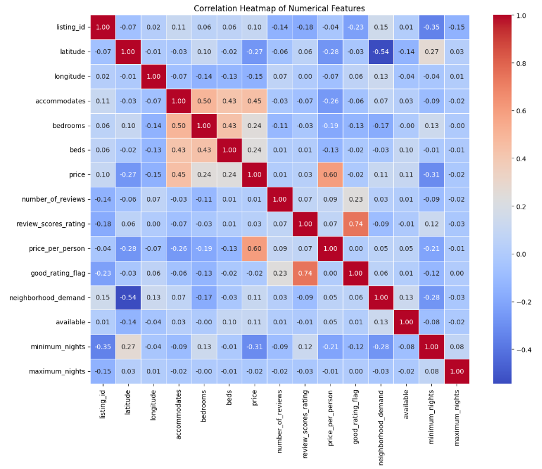

*Figure 2 — Correlation heat map over every numeric feature. This is the finding the entire report
hangs on: price and occupancy are only weakly related. The host-forum assumption — drop your
price and you fill up — is not visible in this data. Read it with 2.3 in mind: weak correlation
rules out a straight-line relationship, not every relationship, which is why the scatter comes
next.*

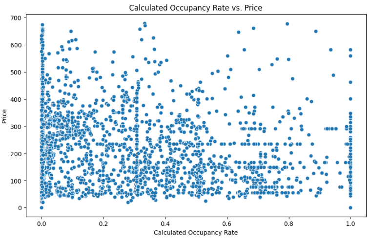

*Figure 3 — Occupancy against price, every listing. No clean downward slope. Cheap listings are
not automatically fuller, and expensive ones are not automatically empty. There is also no clean
linear structure at all, which is the direct reason we chose a tree ensemble over linear
regression (2.7).*

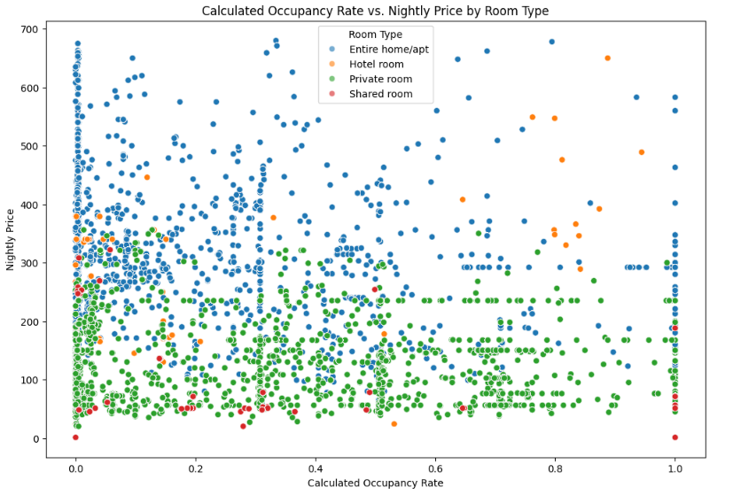

*Figure 8 — The same scatter, split by room type. Entire homes, private rooms, hotel rooms and
shared rooms behave like four different markets. This single figure justifies two later decisions:
per-room-type outlier removal (2.4) and a model that handles interactions natively (2.7).*

### Where the money is, and where the guests are

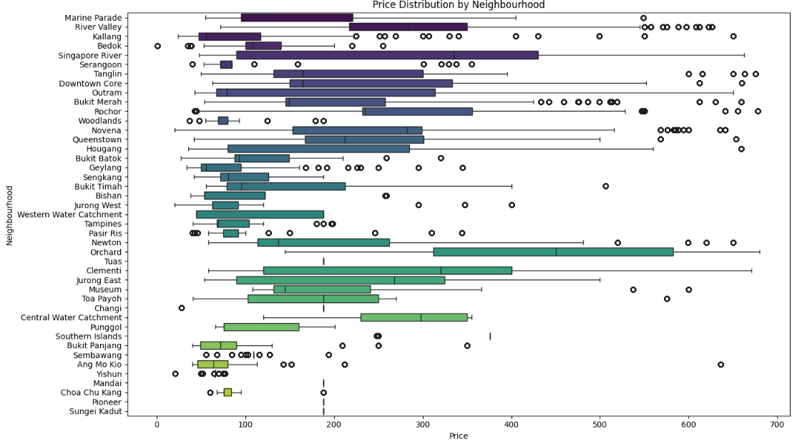

*Figure 4 — Price distribution by neighbourhood. Long tails everywhere: a handful of listings
priced in the thousands drag every average, which is what the IQR step in preparation deals with.*

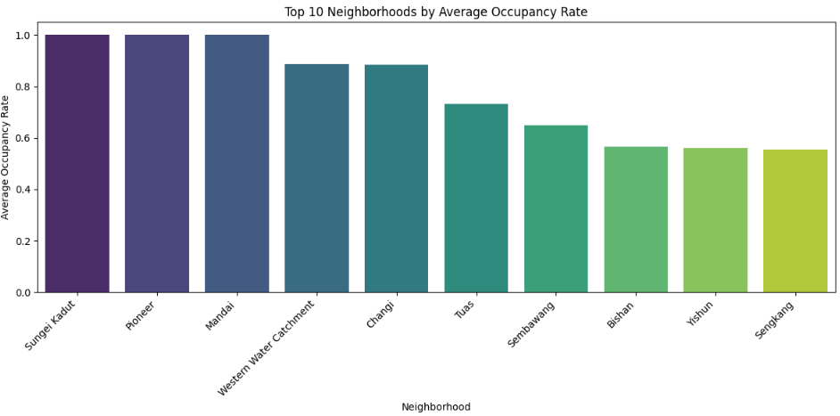

*Figure 5 — Top 10 neighbourhoods by occupancy. Read this next to Figure 4: it is not the same
list as the top 10 by price. The expensive neighbourhoods and the busy neighbourhoods are
different places.*

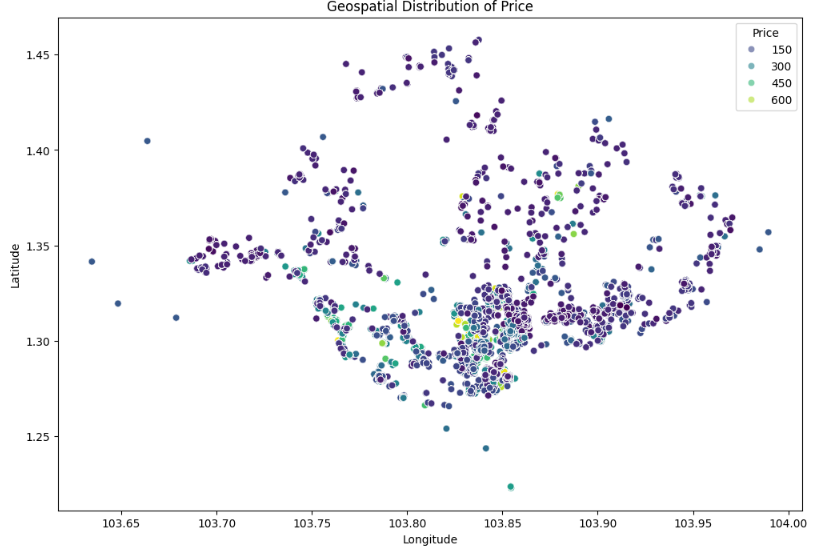

*Figure 6 — Every listing plotted by latitude and longitude, coloured by price. The expensive
cluster is exactly where you would expect: central, near the water.*

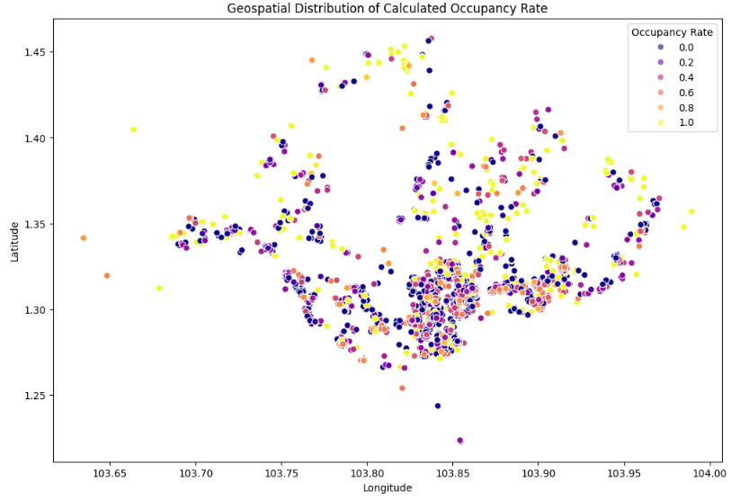

*Figure 7 — The same map, coloured by occupancy. Put Figures 6 and 7 side by side and the whole
argument is made in one glance: the hot spots do not overlap. Where prices are highest is not
where listings stay fullest. This pair is the single most persuasive thing in the report, and it
is the spatial version of the weak correlation in Figure 2.*

### The finding nobody expected

Average availability was **0.7206 on non-holidays vs 0.7168 on holidays** — essentially flat,
across New Year, Chinese New Year, Hari Raya, Labour Day and National Day.

Singapore's short-stay demand is **not** driven by the local holiday calendar the way a resort
market would be. Plausible reason: a large share of the demand is business and regional transit
travel, which does not follow public holidays. Worth knowing before you build a seasonal pricing
rule that does nothing.

---

## 6 · Data preparation, step by step

| # | Step | Why |
|---|---|---|
| 1 | Drop free-text, URLs, host bios and heavily-missing review scores | no predictive value, or MNAR (2.2) |
| 2 | Reorder columns: identifiers, features, targets | makes every later screenshot readable |
| 3 | Fix datatypes: `$120.00` → `120.00`, `95%` → `0.95`, strings → dates | text columns silently break every aggregation |
| 4 | One-hot encode `room_type` | avoids implying a false ordering (2.5) |
| 5 | Remove outliers **per room type** with the IQR rule | a global cut-off deletes real homes and keeps absurd shared rooms (2.4) |
| 6 | Engineer weekly occupancy rate from the calendar | creates the second target the business question is about (2.6) |
| 7 | Join listings to the aggregated calendar, export one prepared CSV | modelling starts from a file that can be re-read exactly |

Step 7 matters more than it looks: exporting one prepared file means the modelling stage is
reproducible without re-running the whole cleaning pipeline, and three group members are all
working from an identical dataset.

---

## 7 · Modelling

**Model:** Gradient Boosted Trees (XGBoost family), built in **KNIME**, one learner per target,
both fed from the same partitioned table.

The reasoning is in 2.7 — non-linear surface, mixed scales, real interactions.

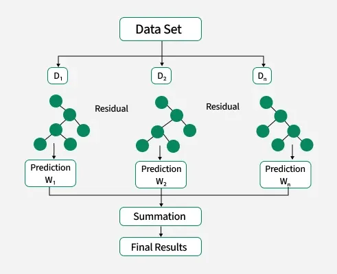

*Figure 9 — Gradient boosting in one picture. Each tree learns what the previous trees got wrong
(the residual), and the final prediction is the sum of the chain. This is the mechanism that lets
a stack of shallow trees model interactions no single tree could.*

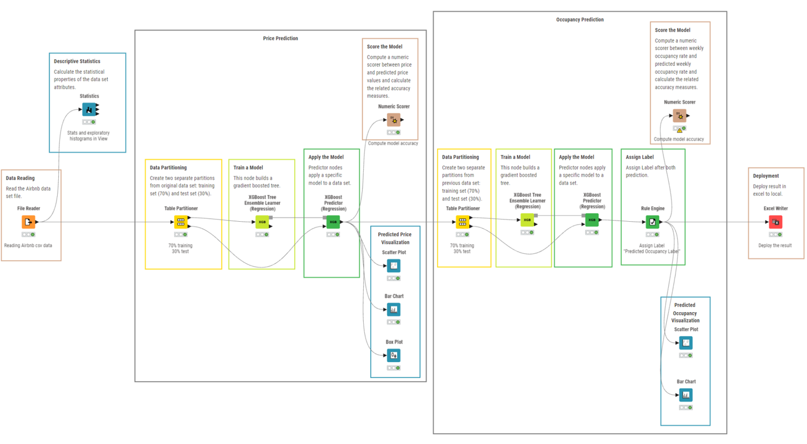

*Figure 1 — The full KNIME workflow. Left to right: File Reader → Statistics → Rule Engine
(labelling) → Table Partitioner → GBT Learner + Predictor, twice, one branch per target → Numeric
Scorer → the scatter / bar / box visuals → Excel Writer. The value of doing it in KNIME is exactly
this: the whole method is one readable picture, which matters enormously on a group project where
three people have to agree on what was done.*

---

## 8 · Evaluation

### Price model

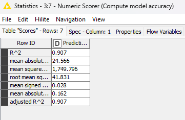

*Figure 10 — Numeric scorer output for the price model.*

| Metric | Value | Reading |
|---|---|---|
| R² | **0.907** | 90.7% of price variance explained |
| Adjusted R² | 0.907 | identical to R², so the predictor count is not inflating it |
| MAE | \$24.57 | typical error, small against nightly prices |
| RMSE | \$41.83 | 1.7× the MAE → a heavy tail of big misses (2.8) |
| Mean signed difference | +0.028 | no systematic over- or under-pricing |
| MAPE | 16.2% | predictions land within ~16% of actual |

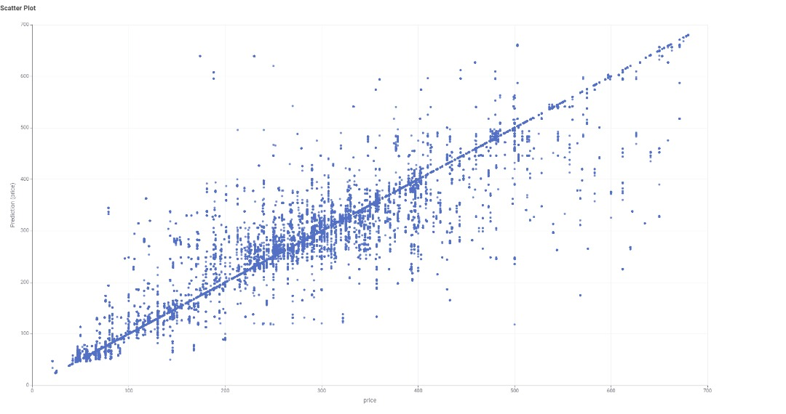

*Figure 11 — Predicted against actual price. The cloud hugs the diagonal, which is what R² 0.907
looks like — but notice the spread widening at the top end. The model under-predicts expensive
listings, because there are far fewer of them to learn from. This figure is the RMSE-vs-MAE gap
from 2.8, made visible: the heavy tail lives at the high end of the price range.*

### Occupancy model

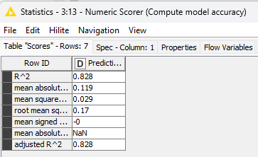

*Figure 12 — Numeric scorer for the occupancy model. Clearly the weaker of the two, and the report
says so rather than burying it.*

| Metric | Value | Reading |
|---|---|---|
| R² | **0.828** | 82.8% of weekly occupancy variance explained |
| MAE | 0.119 | ~12 percentage points of occupancy |
| RMSE | 0.17 | some listings are genuinely hard |
| Mean signed difference | ≈ 0 | unbiased |
| MAPE | undefined | some listings have zero occupied nights — division by zero (2.8), not a bug |

Why occupancy is harder than price: price is largely a function of the listing's own attributes,
which we have. Occupancy also depends on things we do not have — the host's response time, how
the listing ranks in Airbnb search, review recency, and competitor pricing that week.

### Beyond the single number

R² alone can hide a model that is right on average and wrong everywhere specific. So:

- The **neighbourhood bar chart** shows slight **over**-prediction in Marine Parade and slight
  **under**-prediction in Downtown Core — errors in both directions, which is what unbiased looks
  like in practice.
- The **box plot** shows predicted and actual medians and IQRs aligning across neighbourhoods, so
  the model is not systematically broken in any one place.

---

## 9 · Deployment and what it means for a host

Predictions are written out with an Excel Writer — a host-readable table of listing, predicted
price and predicted occupancy — and the report covers the graded governance parts: model
repository, registration, validation.

The interpretation is where the analysis earns its keep:

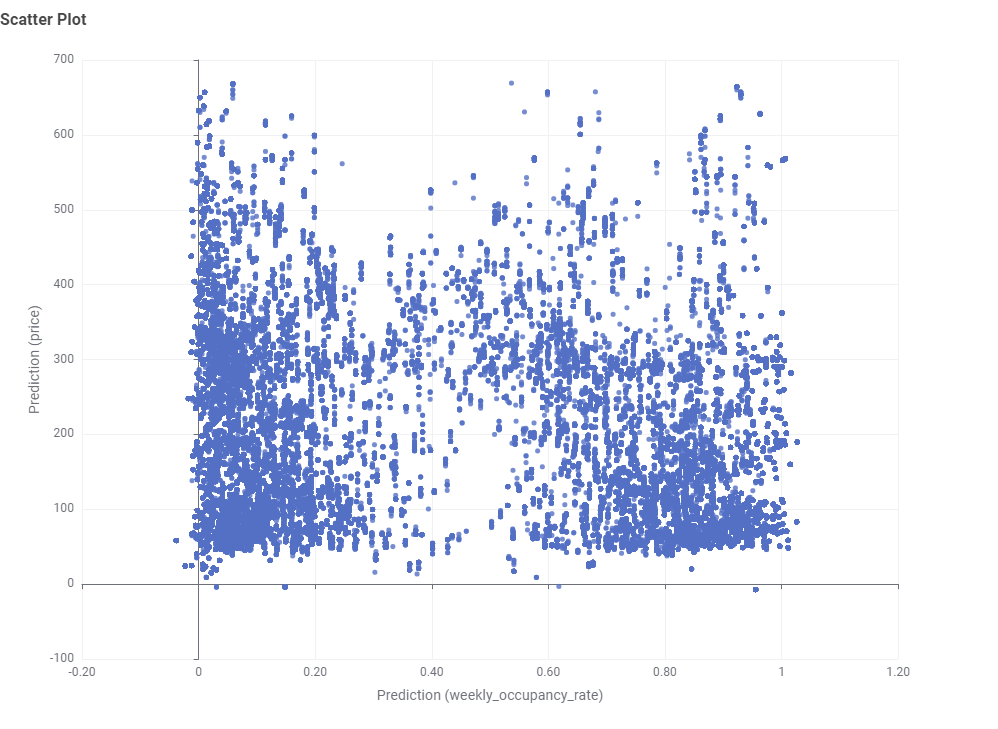

*Figure 13 — Predicted price against predicted occupancy, and the recommendation in one chart. The
market splits into two curves: a high-utilisation segment around \$50–150 a night that stays full,
and a low-utilisation premium segment that earns more per booked night and sits empty more often.
Neither is wrong. A host's real decision is which curve they want to be on — and that is a
sentence Smart Pricing never gives them.*

## 10 · What I would do differently

- **Keep a time-based holdout**, not just a random partition (2.9). This is the most serious
  weakness in the project, and I would fix it first.
- **Report feature importance per target, side by side.** The report proves accuracy but never
  says *which* features carried it — and for a host, that is the most actionable output of all.
  Boosted trees give this almost for free, so it is an omission rather than a limitation.
- **MAPE for occupancy needs a different formulation** or a floor, because of the zeros.

## 11 · How this connects to the other projects

- [03 · E-commerce](../03-ecommerce-purchase-prediction) uses the same boosting family for the
  opposite diagnosis: there the problem was variance (unstable trees), here it is bias (a
  non-linear surface a simple model cannot capture).
- [09 · Power BI](../09-superstore-powerbi) makes the same argument as Figures 6 and 7 — two
  measures that look like they should move together and do not.

## Files

```text
workflow/Airbnb Price and Occupancy Optimization (XGBoost).knwf   the KNIME workflow
figures/                                                          the 13 figures above
```

Open with KNIME Analytics Platform → File → Import KNIME Workflow. Data from
[insideairbnb.com](http://insideairbnb.com/get-the-data/) — not included here; the cleaned
modelling file alone is 168 MB.
