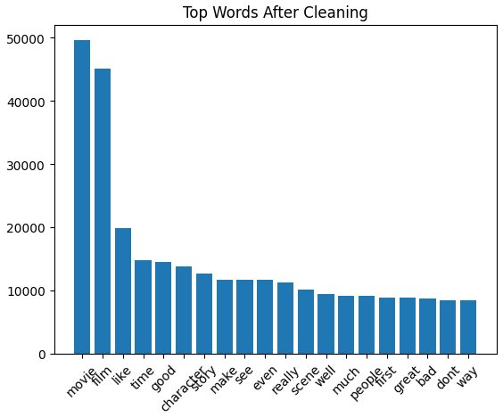
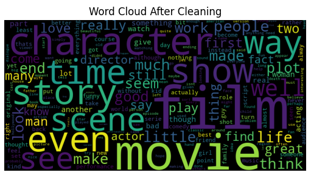
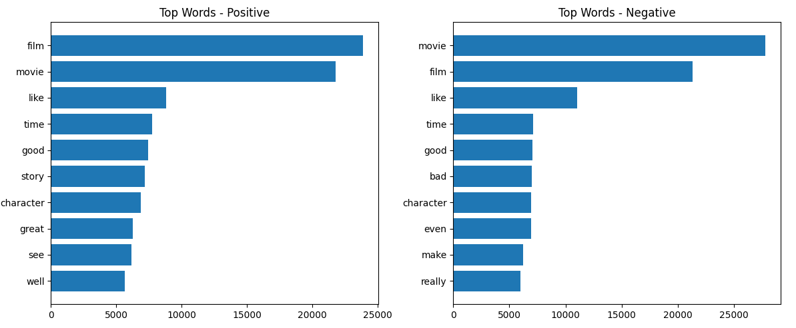
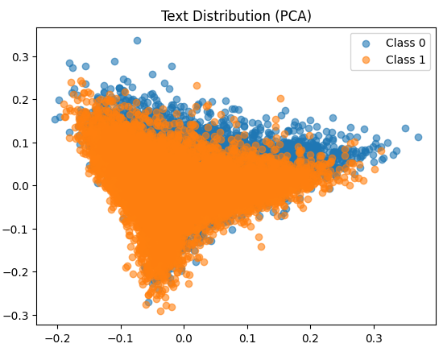
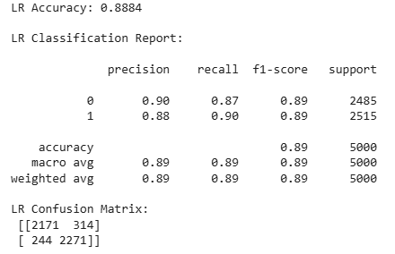
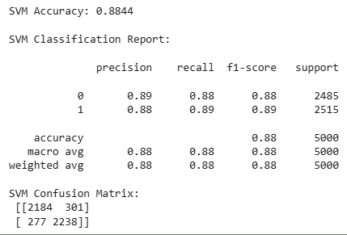
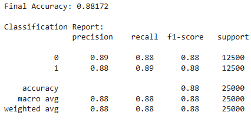
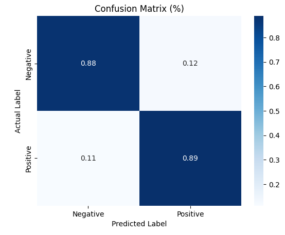

# 05 · IMDB Movie Review Sentiment Analysis (NLP)

> **MAXD 5153 Big Data Analytics and Visualization · Assignment 1 · pair (M. Iman Firdaus + M. Syahmi) · May 2026**
> Written up in JACTA journal format.

## 1 · Why this project exists

Online platforms generate far more review text than anyone can read. A single film can carry tens
of thousands of reviews, and the useful question — *did people like it, and what for* — is buried
in prose. Sentiment analysis turns that text into a label a system can count, sort and alert on.

**Goal:** classify IMDB movie reviews as positive or negative, compare three classical models,
and report the one that actually **generalises** — not the one with the prettiest validation
number.

---

## 2 · The concepts behind this project

This is the section to read if you want to understand *why* the pipeline looks the way it does.

### 2.1 The core problem: computers cannot read

A model cannot consume "this film was unwatchable". It consumes numbers. So every NLP pipeline is
fundamentally a **text → numbers** converter, and almost every decision in this project is about
how to do that conversion without destroying meaning.

### 2.2 Tokenisation

Splitting text into units (tokens), usually words. Sounds trivial, is not: `don't` is one token
or two, `New York` is arguably one, and punctuation is sometimes meaningful (`!!!`) and sometimes
not. Every choice here silently changes what the model can learn.

### 2.3 Stopwords

Words so common they carry almost no discriminating signal — *the, is, at, which*. Removing them
shrinks the vocabulary and reduces noise.

**But it is dangerous**, and this project shows exactly why: `not` is on every standard stopword
list. Remove it blindly and "not good" becomes "good". That is the single most important idea in
section 5.

### 2.4 Stemming vs lemmatisation

Both reduce word forms to a common root, so the model does not treat *watch*, *watched* and
*watching* as three unrelated features.

| | Stemming | Lemmatisation |
|---|---|---|
| How | chops suffixes by rule | looks the word up in a dictionary, using its part of speech |
| `studies` → | `studi` | `study` |
| `movies` → | `movi` | `movie` |
| Speed | fast | slower |
| Output | not always a real word | always a real word |

I used **lemmatisation**, because the model's coefficients are part of the deliverable. A
coefficient attached to `movi` is useless to a human reader; one attached to `movie` is evidence.

### 2.5 Bag-of-words and n-grams

**Bag-of-words** represents a document as a vector of word counts and throws word order away
entirely. "Dog bites man" and "man bites dog" become identical. That is a real loss, and it is
the ceiling this project eventually hits.

**n-grams** claw a little of it back by treating adjacent word sequences as features too:

- unigrams: `waste`, `time`
- bigrams: `waste time`

`ngram_range=(1, 2)` means both. Bigrams are how `not_good` and `waste time` survive as single
meaningful features.

### 2.6 TF-IDF — the formula, explained

Term Frequency–Inverse Document Frequency scores how important a word is to *one document*
relative to the *whole corpus*.

```
TF(t, d)   = (times term t appears in document d) / (total terms in d)
IDF(t)     = log( total documents / documents containing t )
TF-IDF     = TF × IDF
```

The intuition:

- **TF** goes up when a word appears a lot in this review.
- **IDF** goes *down* when the word appears in lots of reviews. A word in every document has
  IDF ≈ log(1) = 0, so it gets crushed to nothing.
- Multiply them and you get: *frequent here, rare everywhere else* = high score.

So "film" — which appears in nearly every review — is damped almost to zero, and "unwatchable" —
rare but decisive — is amplified. Raw word counts cannot do this; that is the whole reason TF-IDF
exists.

### 2.7 Sparse, high-dimensional feature spaces

With 10,000 vocabulary features, each review is a 10,000-dimensional vector — and almost every
entry is zero, because a single review uses maybe 100 distinct words. That is a **sparse** matrix.

Two consequences that shape the model choice:

1. **Linear models do unusually well here.** In very high dimensions, classes are often linearly
   separable even when they look hopelessly mixed in 2-D (section 7 shows this directly).
2. **Distance-based methods struggle.** In high dimensions every point is roughly equidistant
   from every other — the "curse of dimensionality" — so k-NN-style reasoning degrades.

### 2.8 The three models, and how each one reasons

| Model | Its assumption about the world | Strength here | Weakness here |
|---|---|---|---|
| **Logistic Regression** | the log-odds of the class are a linear combination of features | coefficients read directly as per-word sentiment weights | cannot model interactions between words |
| **Linear SVM** | find the hyperplane with the widest margin between classes | very strong in high dimensions; robust to irrelevant features | outputs a distance, not a probability |
| **Multinomial Naive Bayes** | features are conditionally independent given the class | extremely fast, works with little data | the independence assumption is plainly false for language |

Three genuinely different inductive biases — not three tunings of the same idea. That is what
makes the comparison informative.

### 2.9 Train / validation / test, and leakage

- **Train** — the model fits its parameters here.
- **Validation** — you compare models and pick hyperparameters here.
- **Test** — touched **once**, at the very end, to estimate real-world performance.

If you tune against the test set, you have effectively trained on it, and your reported number is
optimistic fiction. The specific failure mode is called **model-selection overfitting**, and
section 8 shows the evidence that it did not happen here.

**Leakage** is the related sin: letting information from test data reach the training process.
In text work the classic version is fitting the vectoriser on the full dataset before splitting —
which is why the code calls `fit_transform` on train and only `transform` on test.

### 2.10 Precision, recall, F1

For the positive class:

```
Precision = TP / (TP + FP)   "when I said positive, how often was I right?"
Recall    = TP / (TP + FN)   "of all the real positives, how many did I catch?"
F1        = 2 · (P · R) / (P + R)    the harmonic mean
```

The harmonic mean is used rather than the arithmetic mean because it punishes imbalance: a model
with precision 1.0 and recall 0.0 gets F1 = 0, not 0.5.

On **this** dataset the classes are balanced 50/50, so accuracy is a fair headline number. That
is unusual — compare with [03 · E-commerce](../03-ecommerce-purchase-prediction), where 84.53% of
rows are one class and accuracy becomes actively misleading.

---

## 3 · The framework

A deliberately classical NLP pipeline, each stage earning its place:

| Stage | Decision made here | Why it matters |
|---|---|---|
| **Clean** | negation handling, lemmatisation | one wrong ordering here flips the label the model learns (2.3) |
| **Vectorise** | TF-IDF, unigrams + bigrams | rare decisive words get weight, common words get damped (2.6) |
| **Compare** | LR vs SVM vs Naive Bayes | three different ways of reasoning, not three tunings of one (2.8) |
| **Tune** | GridSearchCV, 3-fold | the estimate comes from CV, never from the test set (2.9) |
| **Test once** | held-out 25,000 reviews | touched a single time, at the very end |

Choosing this over a transformer was deliberate — see section 11.

## 4 · Data

The IMDB review corpus: **50,000 labelled reviews**, balanced 25,000 positive / 25,000 negative,
split into train and test halves.

Balanced matters (2.10): it means accuracy is a fair headline metric here, which is *not* true of
most classification problems.

## 5 · EDA, before touching a model



*Figure 2 — Most frequent tokens across the corpus. Before cleaning this list is almost entirely
stopwords. That observation is the reason the preprocessing step in section 6 exists at all.*



*Figure 1 — Word cloud after cleaning. What survives is `movie`, `film`, `character`, `story`,
`scene` — topic words, not sentiment words. This is a sanity check that the cleaning worked, not
evidence of anything about sentiment. Worth saying out loud, because word clouds get
over-interpreted constantly.*



*Figure 3 — Top words split by sentiment, and the actually useful chart. The signal is not in
either list — it is in the difference between them. Notice how much the two lists overlap in the
middle: that shared vocabulary is precisely why a bag-of-words model caps out around 88% and
cannot go further (2.5).*

Also checked: review length and word count show a long tail — a few reviews are essays, most are
short.

## 6 · Preprocessing, and the step people skip

```python
custom_stopwords = set(['would', 'could', 'also', 'one', 'get'])
all_stopwords = stop_words.union(custom_stopwords)

def handle_negation(text):
    # "not good" -> "not_good", so the negation survives tokenisation
    return re.sub(r"\bnot\s+(\w+)", r"not_\1", text)

def clean_text(text):
    text = str(text).lower()
    text = handle_negation(text)          # BEFORE punctuation and stopword removal
    text = re.sub(r'[^\w\s]', '', text)   # punctuation and HTML leftovers
    text = re.sub(r'\d+', '', text)       # digits carry no sentiment here
    words = [lemmatizer.lemmatize(w) for w in text.split()
             if w not in all_stopwords and len(w) > 2]
    return " ".join(words)

train['clean_text'] = train['review'].apply(clean_text)
test['clean_text']  = test['review'].apply(clean_text)
```

> **Order is the whole trick.** Negation handling runs **first**. Do it after stopword removal and
> "not" is already gone (2.3) — "not good" becomes `good`, and the model is trained on the exact
> opposite of what the reviewer meant. This is a silent bug: nothing crashes, the accuracy just
> sits a few points lower and nobody ever finds out why.

Each step, and its reason:

| Step | Why |
|---|---|
| lower-case | `Good` and `good` are the same feature; not doing this doubles the vocabulary for nothing |
| negation join | preserves meaning that tokenisation would destroy (2.5) |
| strip punctuation and HTML | the corpus is scraped, so `<br />` tags are everywhere |
| drop digits | year numbers and runtimes carry no sentiment in this corpus |
| stopword removal | shrinks the feature space, removes noise (2.3) |
| `len(w) > 2` | drops leftover fragments from the punctuation strip |
| lemmatise | collapses word forms while keeping features readable (2.4) |

## 7 · Features — TF-IDF with bigrams

```python
vectorizer = TfidfVectorizer(
    max_features=10000,   # cap the vocabulary: the long tail is noise
    ngram_range=(1, 2),   # unigrams + bigrams, so "not_good" and "waste time" survive
    min_df=5,             # a word in fewer than 5 documents cannot generalise
    max_df=0.8            # a word in more than 80% of documents carries no signal
)

X       = vectorizer.fit_transform(train['clean_text'])
X_test  = vectorizer.transform(test['clean_text'])     # transform only, never re-fit
```

Every parameter is a decision, not a default:

- **`max_features=10000`** — the vocabulary has a long tail of words appearing once or twice.
  They cannot generalise and they inflate the matrix. Cap it.
- **`min_df=5`** — the same idea from the other end: a word in fewer than five documents is
  effectively a typo.
- **`max_df=0.8`** — a corpus-specific stopword filter. In a film corpus, "movie" is a stopword
  even though no standard list says so.
- **`transform`, never `fit_transform`, on test** — this is the leakage guard from 2.9.



*Figure 4 — The TF-IDF feature space projected to two PCA components. The two classes overlap
heavily, and that is not a failure — it is 2.7 made visible. The separation lives in thousands of
dimensions, and a 2-D projection necessarily throws almost all of it away. Anyone who looks at
this chart and concludes the problem is unsolvable has misunderstood what the picture can show.*

## 8 · Models — three different ways of reasoning

```python
lr  = LogisticRegression(max_iter=1000).fit(X_train, y_train)
nb  = MultinomialNB().fit(X_train, y_train)
svm = LinearSVC().fit(X_train, y_train)
```

| Model | Validation accuracy | Precision / recall (class 1) | Character |
|---|---|---|---|
| **Logistic Regression** | **88.84%** | 0.88 / 0.90 | probabilistic, coefficients readable as word weights |
| Linear SVM | 88.44% | 0.88 / 0.89 | maximum-margin, strong in high dimensions |
| Multinomial Naive Bayes | 86.30% | 0.86 / 0.87 | fastest, assumes word independence |



*Figure 5 — Logistic regression classification report, 88.84%. Best of the three, and the
precision/recall are near-symmetric across both classes — the model is not trading one class off
against the other.*



*Figure 6 — Linear SVM, 88.44%. Four-tenths of a point behind, which on 25,000 samples is not a
real difference. So the tie-break went to logistic regression for being cheaper to train and,
more importantly, interpretable: its coefficients are literally the words that swing a review.*

Naive Bayes trailing by 2.5 points is exactly what 2.8 predicts. Its independence assumption says
that seeing "waste" tells you nothing about whether "time" follows — obviously false for
language, and the cost of that false assumption shows up as the accuracy gap.

## 9 · Tuning, and the honest test

```python
models = {
    "Logistic Regression": (LogisticRegression(max_iter=1000), {'C': [0.1, 1, 10]}),
    "Naive Bayes":         (MultinomialNB(),                   {'alpha': [0.1, 1, 10]}),
    "SVM":                 (LinearSVC(),                       {'C': [0.1, 1, 10]}),
}

for name, (model, params) in models.items():
    grid = GridSearchCV(model, params, cv=3).fit(X_train, y_train)
    best_model = grid.best_estimator_
    cv_acc = cross_val_score(best_model, X, y, cv=3).mean()
    cv_f1  = cross_val_score(best_model, X, y, cv=3, scoring='f1_weighted').mean()
    test_score = best_model.score(X_test, y_test)    # touched once, at the end
```

**What the hyperparameters actually do:**

- **`C`** (logistic regression and SVM) is the *inverse* of regularisation strength. Small `C` =
  strong regularisation = simpler model, more bias, less variance. Large `C` = the model is
  allowed to fit the training data closely, risking overfitting. It is the bias–variance dial.
- **`alpha`** (Naive Bayes) is Laplace smoothing. Without it, a word never seen with a class gets
  probability zero, and because Naive Bayes *multiplies* probabilities, one zero wipes out the
  entire prediction. `alpha` adds a small count to everything so nothing is ever impossible.

**Why cross-validation** rather than a single validation split: with one split, your model choice
depends on which rows happened to land in it. 3-fold CV trains three times on different
two-thirds and averages, so the comparison is about the models rather than about luck.



*Figure 7 — Held-out test: 88.17% on 25,000 unseen reviews. Compare with the 88.84% validation
figure: the gap is under a point. That is the evidence that model-selection overfitting (2.9) did
not happen. A large drop here is precisely what that failure looks like, and there isn't one.*



*Figure 8 — Test confusion matrix: 10,947 / 1,553 / 1,404 / 11,096. Almost perfectly symmetric —
12% of negatives called positive, 11% of positives called negative. No class is being sacrificed
for the other, so there is no hidden bias to explain away.*

## 10 · Error analysis — where the missing 12% lives

The notebook prints the misclassified reviews, and the pattern is consistent:

- **sarcasm** — "this program was on for a brief period when I…" reads positive word by word and
  is scathing in context;
- **mixed verdicts** — praise the acting, damn the plot, one label required;
- **plot summaries** — reviews that spend most of their words describing the film rather than
  judging it.

All three are the same underlying limitation from 2.5: **bag-of-words sees words, not the
relationships between them.** Sarcasm is entirely a relationship between literal meaning and
context, and the model has no representation of context at all. Figure 3's overlapping
vocabularies are that same ceiling seen from the other end.

## 11 · What I would do next

- **Transformer embeddings (BERT-class).** Attention lets each word's representation depend on
  its neighbours, which is exactly the machinery bag-of-words lacks. This TF-IDF result is the
  baseline to beat — any transformer that cannot clear 88.17% is not worth the compute.
- **Aspect-level sentiment** — acting vs plot vs pacing — instead of forcing one label onto a
  mixed review.
- **Calibration**, so the output probability can be used as a confidence rather than just a
  ranking.

## 12 · The takeaway I would give in an interview

On sparse high-dimensional text, **a well-preprocessed linear model is extremely hard to beat.**
It trains in seconds, it stays interpretable — the biggest coefficients are literally the words
that swing a review — and it gives you a real baseline. Reaching for a transformer first would
have cost hours and taught less, and I would not have been able to point at Figure 3 and explain
exactly where the remaining error comes from.

The wider lesson, and the one I actually use: **know what your representation throws away.**
Bag-of-words throws away order. Once you have said that out loud, every result in the project —
the 88% ceiling, the sarcasm failures, the overlapping word lists — stops being a surprise.

## 13 · How this connects to the other projects

- [03 · E-commerce](../03-ecommerce-purchase-prediction) is the mirror image on metrics: there
  the classes are 85/15 and accuracy lies, here they are 50/50 and accuracy is fine. Same metric,
  opposite verdict, because of the data.
- [02 · MVTec](../02-mvtec-industrial-defect-ml) makes the same representation argument for
  images: a dense layer throws away spatial structure the way bag-of-words throws away order, and
  convolution is the fix in the same way n-grams are here.

## Files

```text
notebook.ipynb                the submitted notebook
code/sentiment_pipeline.py    code cells extracted, markdown kept as comments
figures/                      the 8 figures above, from the report
```

Dataset: [IMDB 50K reviews](https://ai.stanford.edu/~amaas/data/sentiment/) — not included.
