# 06 · Student Career Recommendation System (Neo4j, Cypher)

> **MAXD 5123 Big Data Management · Project 1 · Group 2 · submitted 31 May 2026**
> Hanis binti Hussin, **Muhammad Iman Firdaus bin Md Rostan**, Norarmiza binti Arsad
> Instructors: Ts. Dr. Norfadzlia binti Mohd Yusof, Ts. Dr. Abdul Syukor bin Mohamad Jaya

## 1 · Why this project exists

A university wants to tell a student which careers they are heading towards, based on the courses
they took and the skills they hold — and, when they are not qualified yet, **which single course
would close the gap**.

That is a **relationship** problem, not a rows-and-columns problem. Students connect to courses,
courses teach skills, jobs require skills, jobs relate back to courses. In a relational schema
every recommendation is three or four JOINs, and every new *kind* of connection means a schema
change and a migration.

---

## 2 · The concepts behind this project

### 2.1 The property graph model

A graph database stores four things:

| Element | What it is | Example here |
|---|---|---|
| **Node** | an entity | a Student, a Skill, a Job, a Course |
| **Label** | the node's type | `:Student`, `:Skill` |
| **Relationship** | a *directed, typed* connection between two nodes | `(:Student)-[:HAS_SKILL]->(:Skill)` |
| **Property** | a key-value pair on a node **or a relationship** | `{name: 'Ali', interest: 'Data Science'}` |

Two things surprise people coming from SQL:

1. **Relationships are first-class objects.** They have a type, a direction, and can carry their
   own properties. In SQL a relationship is a foreign key — a number in a column, with no
   identity of its own.
2. **There is no fixed schema.** You can add a new relationship type tomorrow without migrating
   anything, because the "schema" is just whatever patterns happen to exist.

### 2.2 Index-free adjacency — the idea that makes graphs fast

This is the single concept worth understanding, because it explains every performance claim in
the report.

In a **relational** database, following a relationship means a JOIN: look up rows in table A, look
up matching rows in table B via an index, merge them. The index lookup costs roughly
**O(log n)** where *n* is the number of rows **in the whole table**. So as the database grows,
every join gets slower — even joins that only touch five rows.

In a **graph** database with index-free adjacency, each node stores **direct pointers to its
neighbours**. Following a relationship is a pointer dereference: **O(1)**, regardless of how big
the database is. Traversing a five-hop path costs the same whether the graph has a thousand nodes
or a billion.

The practical consequence, and the sentence I would use in an interview: **in SQL the cost of a
query depends on the size of the database; in a graph it depends on the size of the answer.**

### 2.3 Why not the other NoSQL families

The brief asked us to justify the choice rather than assume it:

| Family | Good at | Why not here |
|---|---|---|
| **Document** (MongoDB) | self-contained nested records | relationships *between* documents need application-side joins |
| **Key-value** (Redis) | extremely fast lookup by key | no traversal at all; you cannot ask "what is connected to this" |
| **Column-family** (Cassandra) | wide scans over enormous tables | optimised for scanning many rows, not walking paths |
| **Graph** (Neo4j) | paths, traversals, connected data | ✓ the domain genuinely *is* a network |

And against relational:

| | Relational | Neo4j (graph) |
|---|---|---|
| Relationship storage | foreign keys, resolved at query time | stored as first-class edges |
| A recommendation | multi-table JOIN, degrades as data grows | traversal from a starting node (2.2) |
| Adding a new connection type | schema migration | one new relationship type |
| Schema | fixed up front | flexible, evolves with the data |

### 2.4 Cypher: the pattern is the query

Cypher's design idea is that **a query looks like the thing it matches.** The arrow syntax is
literally a picture of the pattern:

```cypher
(s:Student)-[:HAS_SKILL]->(sk:Skill)<-[:REQUIRES]-(j:Job)
```

Read left to right: a Student, who has a Skill, which is required by a Job. `s`, `sk` and `j` are
variables you can return or filter on.

The clauses map onto SQL more or less directly:

| Cypher | SQL equivalent |
|---|---|
| `MATCH` | `FROM` + `JOIN` |
| `WHERE` | `WHERE` |
| `RETURN` | `SELECT` |
| `WITH` | a subquery or CTE — pipes results into the next stage |
| `OPTIONAL MATCH` | `LEFT JOIN` |
| `MERGE` | `INSERT … ON CONFLICT DO NOTHING` |

`OPTIONAL MATCH` matters more than it sounds. Without it, a student with no matching job simply
**disappears from the result** — and those are exactly the students who most need advising.

### 2.5 MERGE vs CREATE, and idempotency

- **`CREATE`** always makes a new node or relationship. Run it twice and you have two.
- **`MERGE`** matches first and only creates if nothing matched. Run it a hundred times and you
  still have one.

An operation is **idempotent** when doing it repeatedly has the same effect as doing it once.
Build scripts should be idempotent, because in practice they *will* be re-run — after a crash,
during a demo, when somebody forgets they already ran it.

We learned this the hard way (section 7): a `CREATE` block run twice produced duplicate
relationships, nothing errored, and every `COUNT` query silently double-counted. **That is the
worst class of bug — the one that returns a plausible wrong answer instead of failing.**

### 2.6 Traversal depth and the `[*]` operator

```cypher
MATCH path = (s:Student {name:'Ali'})-[*]-(j:Job {title:'Data Scientist'})
RETURN path;
```

`[*]` means "any number of relationships of any type". This is a **variable-length path** query,
and it is the thing that is genuinely hard to express in SQL — there you would need a recursive
CTE, and you would have to know the shape in advance.

In production you would bound it (`[*1..4]`), because an unbounded traversal on a dense graph can
explore an enormous number of paths. At this dataset's size it is harmless.

### 2.7 Why the returned *path* is the point

Most recommender systems output a score. This one outputs a **path**, and the path is the
explanation:

> Ali → has skill Python → required by → Data Scientist

A student can read that. A collaborative-filtering score of 0.87 they cannot. Explainability is
not a bolt-on here — it falls out of the data model for free, and that is a genuine argument for
choosing a graph even when accuracy is not the differentiator.

---

## 3 · Requirements we designed against

**Functional:** store students, courses, skills and jobs; recommend jobs per student; **show the
path that produced a recommendation**; identify skill gaps; find similar students; report the
most common and most demanded skills.

**Non-functional:** queries fast enough to be interactive, a schema flexible enough to add a new
course without a migration, and data that stays consistent when relationships get added twice by
mistake — which we hit for real, see section 7.

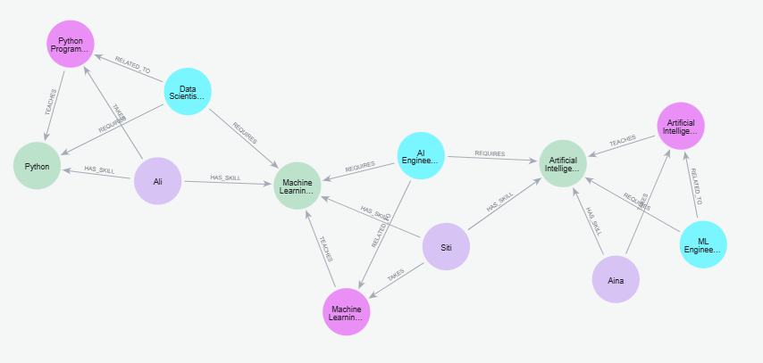

*Figure 1 — The data model, drawn by Neo4j Browser from the actual database. Student, Skill, Job,
Course and Mentor nodes with `HAS_SKILL`, `REQUIRES`, `TEACHES` and `RELATED_TO` edges between
them. Notice that this picture **is** the schema — there is no separate ER diagram that can drift
out of date, because it is generated from what is really stored (2.1).*

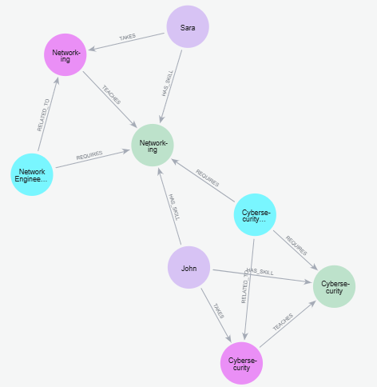

*Figure 2 — One student, traced through their skills to the jobs those skills unlock. This single
path is the entire argument for using a graph (2.7). In SQL, producing this explanation means
reconstructing it from join results; here the path **is** the result, and it comes back as one
object you can hand to the student as the reason.*

---

## 4 · Building the graph, in order

### Step 1 · Create the database, then clear it

```cypher
CREATE DATABASE careerdb;
:use careerdb

MATCH (n) DETACH DELETE n;      // DETACH removes the relationships too
```

`DETACH` is required: Neo4j refuses to delete a node that still has relationships attached,
because that would leave dangling edges. `DETACH DELETE` removes both. A clean slate every run
means results never depend on what was left behind last time.

### Step 2 · Create the nodes

15 students each with a stated interest, plus courses, skills and jobs.

```cypher
CREATE
(:Student {id:1,  name:'Ali',    interest:'Data Science'}),
(:Student {id:2,  name:'Siti',   interest:'Artificial Intelligence'}),
(:Student {id:7,  name:'Aina',   interest:'Machine Learning'}),
(:Student {id:15, name:'Sophia', interest:'Data Analytics'});

CREATE
(:Course {id:1, name:'Python Programming'}),
(:Course {id:2, name:'Machine Learning'}),
(:Course {id:6, name:'Data Visualization'}),
(:Course {id:7, name:'Artificial Intelligence'});
```

### Step 3 · Create the relationships

`TAKES`, `HAS_SKILL`, `TEACHES`, `REQUIRES`, `RELATED_TO` — match the two ends, create the edge.
**This is the part that would be four junction tables in SQL.**

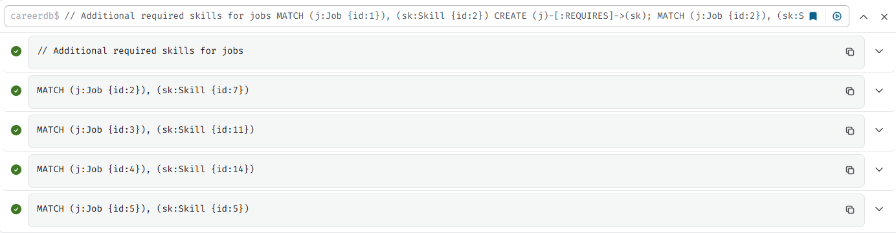

*Figure 4 — The relationship-creation statements running in Neo4j Browser. Using `MERGE` rather
than `CREATE` is the idempotency fix from 2.5 — and the reason it is a fix is in section 7.*

### Step 4 · Verify visually before trusting a single query

```cypher
MATCH p=(n)-[r]->(m) RETURN p;     // draw the whole graph in Neo4j Browser
MATCH (n) RETURN labels(n)[0] AS Category, COUNT(*) AS Total;   // count by type
```

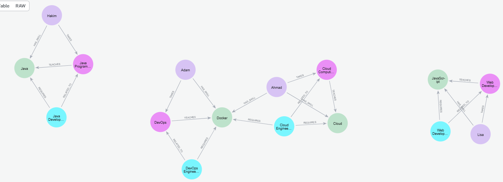

*Figure 3 — The whole graph after loading. Ten seconds of looking at this catches the mistakes
that would otherwise show up as a wrong recommendation three queries later: an orphan node, a
missing edge type, a relationship pointing the wrong way. Direction matters in Cypher — `(a)-->(b)`
and `(a)<--(b)` are different patterns — so a reversed edge is a real bug that a picture catches
instantly and a query does not.*

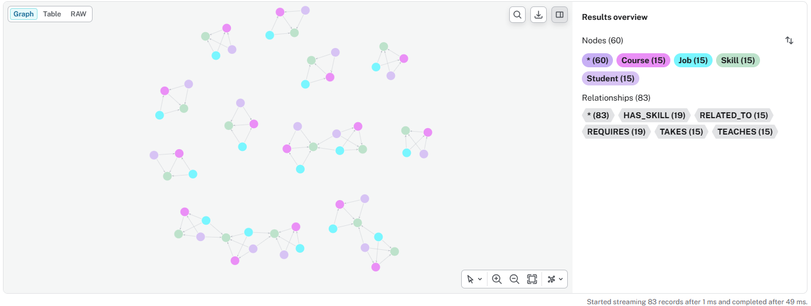

*Figure 5 — The database overview panel: node labels, relationship types and counts. The numeric
version of the same check, and the one that would have caught the duplicate-edge bug earlier.*

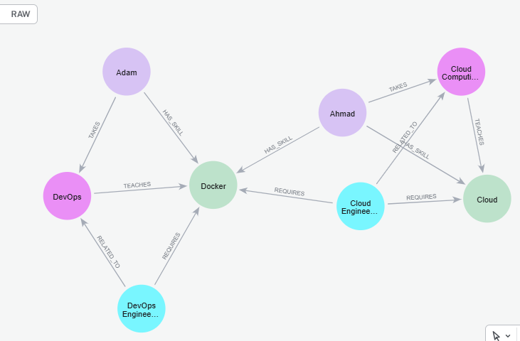

*Figure 6 — A subgraph around DevOps, Docker and Cloud. Zoomed in, you can see the exact chain the
recommender walks: learner → course → skill → job.*

---

## 5 · The queries that make it a recommender

### A full student profile with recommendations

Jobs are reachable two ways — through a skill the student already holds, or through a course they
took. `OPTIONAL MATCH` (2.4) means a student with **no** match still appears in the result
instead of vanishing, which matters because those are exactly the students who need advising most.

```cypher
MATCH (s:Student)
OPTIONAL MATCH (s)-[:TAKES]->(c:Course)
OPTIONAL MATCH (s)-[:HAS_SKILL]->(sk:Skill)
OPTIONAL MATCH (s)-[:HAS_SKILL]->(:Skill)<-[:REQUIRES]-(j1:Job)
OPTIONAL MATCH (s)-[:TAKES]->(:Course)<-[:RELATED_TO]-(j2:Job)
WITH s,
     collect(DISTINCT c.name)  AS Courses,
     collect(DISTINCT sk.name) AS Skills,
     collect(DISTINCT j1.title) + collect(DISTINCT j2.title) AS AllJobs
RETURN s.name AS Student, s.interest AS Interest, Courses, Skills,
       reduce(uniqueJobs = [], job IN AllJobs |
              CASE WHEN job IN uniqueJobs THEN uniqueJobs ELSE uniqueJobs + job END
       ) AS RecommendedJobs;
```

Two Cypher features doing real work here:

- **`WITH`** pipes the result of one stage into the next, the way a CTE does in SQL. It is also
  where the aggregation happens — everything not aggregated becomes the grouping key.
- **`reduce(...)`** de-duplicates by hand. Two `collect` lists concatenated can repeat a job that
  is reachable by both routes, and `DISTINCT` inside each `collect` does not help across them.

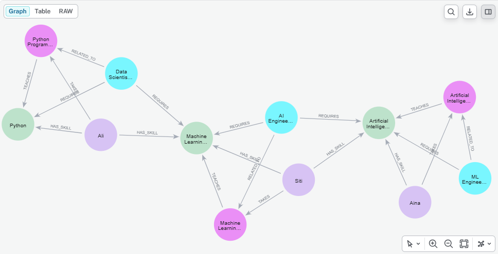

*Figure 7 — The recommendation traversal rendered as a graph. Every edge here is a reason. A
student can look at this and see precisely why a job appeared on their list (2.7).*

### "Why am I being shown this job?"

One line in Cypher, and the hardest thing to produce in SQL (2.6):

```cypher
MATCH path = (s:Student {name:'Ali'})-[*]-(j:Job {title:'Data Scientist'})
RETURN path;
```

### Supply and demand — the same query pointed two ways

```cypher
// what students have
MATCH (s:Student)-[:HAS_SKILL]->(sk:Skill)
RETURN sk.name AS Skill, COUNT(DISTINCT s) AS TotalStudents
ORDER BY TotalStudents DESC;

// what the market asks for
MATCH (j:Job)-[:REQUIRES]->(sk:Skill)
RETURN sk.name AS Skill, COUNT(DISTINCT j) AS TotalJobsRequiringSkill
ORDER BY TotalJobsRequiringSkill DESC;
```

`COUNT(DISTINCT s)` rather than `COUNT(s)` is not cosmetic — it is the guard against the duplicate
relationships in section 7. Without `DISTINCT`, one accidental double edge inflates the count.

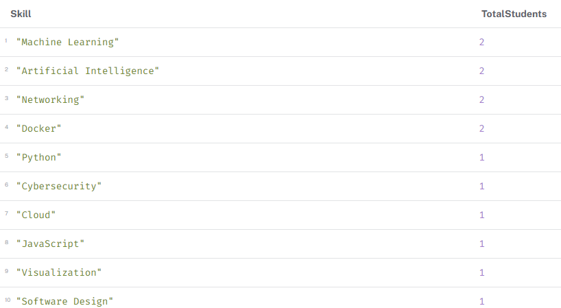

*Figure 11 — The supply side: how many students hold each skill. Machine Learning, AI and
Networking at the top.*

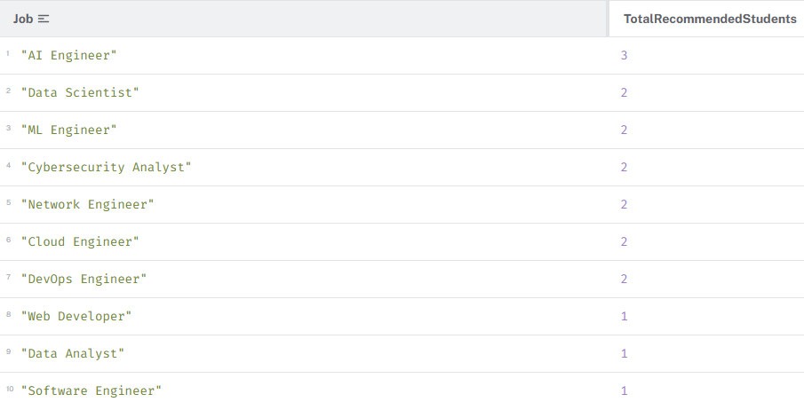

*Figure 9 — The demand side, expressed as recommendations: how many students each job was matched
to. AI Engineer, Data Scientist and ML Engineer come out on top. Run Figures 9 and 11 together and
you have the **cohort-level skills gap** — the output a faculty can act on, as opposed to advice
for one student at a time.*

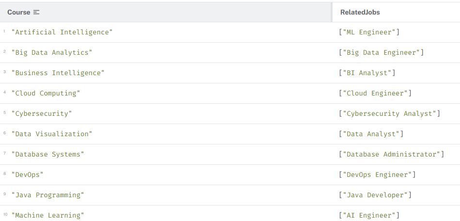

*Figure 10 — Each course mapped to the jobs it feeds into. This is the curriculum view: it tells
the department which courses are carrying the employability story and which are orphans.*

### Skill gaps and peer finding

```cypher
MATCH (s1:Student)-[:HAS_SKILL]->(sk:Skill)<-[:HAS_SKILL]-(s2:Student)
WHERE s1 <> s2
RETURN s1.name AS Student1, s2.name AS Student2, collect(DISTINCT sk.name) AS CommonSkills;
```

The `WHERE s1 <> s2` is necessary because the pattern happily matches a student to themselves —
they do, after all, share every one of their own skills with themselves.

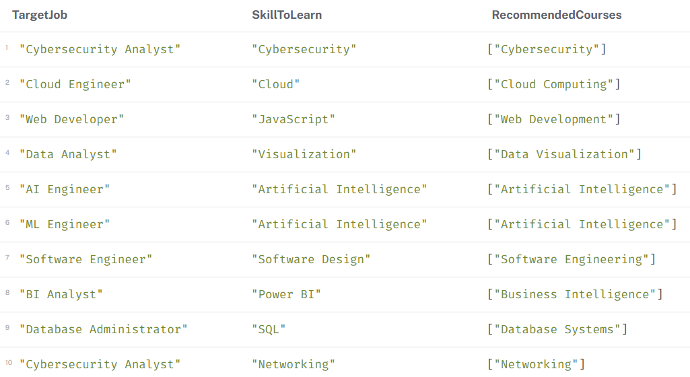

*Figure 12 — The single most useful output in the project: target job → the skill still missing →
the course that teaches it. An advisor can read a row of this table straight out to a student.
Everything else in the report exists to make this table possible.*

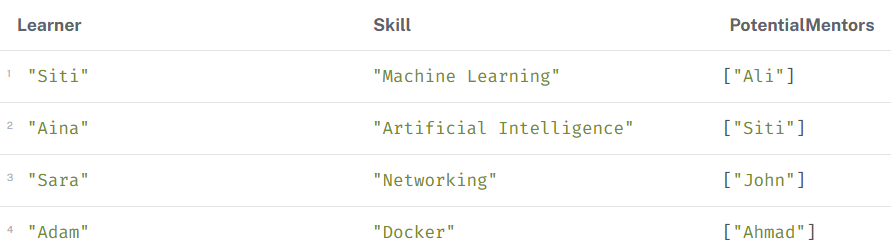

*Figure 13 — Learner → skill they need → peers who already hold it. Same traversal pattern as the
job recommender, pointed at people instead of jobs. That reuse is the payoff of modelling the
domain as a graph: new questions are new patterns, not new schemas.*

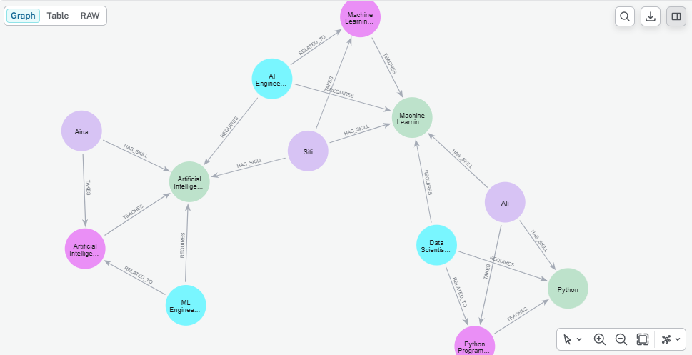

*Figure 8 — The same mentor matching drawn as a graph.*

And "who is already qualified for a named job":

```cypher
MATCH (s:Student)-[:HAS_SKILL]->(sk:Skill)<-[:REQUIRES]-(j:Job {title:'Data Scientist'})
RETURN j.title AS Job,
       collect(DISTINCT s.name) AS QualifiedStudents,
       collect(DISTINCT sk.name) AS MatchingSkills;
```

---

## 6 · The other queries in the report

Beyond the ones shown above, the submission covers: students with **no** recommendation yet (the
advising priority list), courses that lead to jobs, a per-student *market readiness* score, skill-
gap course recommendations, and career-similarity clustering — thirty queries in total.

---

## 7 · A real bug we hit, and the fix

Running a `CREATE` block twice produced **duplicate relationships** — Lisa held `JavaScript`
twice, and Web Developer required it twice. Nothing errored. Every `COUNT` query just silently
double-counted, and the demand chart in Figure 9 was wrong until we found it.

```cypher
MATCH (s:Student {name:'Lisa'})-[r:HAS_SKILL]->(sk:Skill {name:'JavaScript'})
WITH collect(r) AS rels
FOREACH (r IN tail(rels) | DELETE r);       // keep head(rels), delete the rest
```

`collect(r)` gathers the duplicate relationships into a list; `tail(...)` is everything after the
first; `FOREACH` deletes each one. Keep the head, drop the rest.

The better long-term answer is `MERGE` instead of `CREATE` (2.5), so re-running the script is
idempotent. That is the lesson I would carry into any graph build, and it is worth describing in
an interview precisely because **it produced wrong answers rather than errors.**

## 8 · System evaluation (the graded section)

| Criterion | Finding |
|---|---|
| Flexibility | new courses, skills and job types added without touching a schema (2.1) |
| Scalability | traversals stay local to the nodes involved, so cost does not grow with total rows the way a JOIN does (2.2) |
| Query performance | recommendation queries return instantly at this size; the *shape* is what scales, not the machine |
| Suitability | strong fit — the domain genuinely *is* a network of relationships |

## 9 · What I would add, and what I would admit

- **`MERGE` everywhere**, so the script is idempotent.
- **Weighted relationships** — proficiency on `HAS_SKILL`, importance on `REQUIRES` — so
  recommendations can be *ranked* rather than just listed. Right now every match counts the same,
  which is the biggest weakness. Relationship properties (2.1) make this cheap to add.
- **Graph algorithms** from the Graph Data Science library — PageRank to find the most central
  skills, community detection to find natural career clusters. The data model already supports
  them; we simply did not get there.
- **Real data** instead of 15 seeded students.

> Worth being honest about in an interview: the dataset is small and hand-built, so these
> recommendations demonstrate the **graph traversal pattern** rather than a validated recommender.
> There is no offline evaluation here, and I would not claim otherwise.

## 10 · How this connects to the other projects

- The "wrong answer instead of an error" bug in section 7 is the same class of failure as the
  712,565 duplicate calendar rows in [04 · Airbnb](../04-airbnb-price-occupancy-knime). Both were
  silent, both would have corrupted a headline number, and both were caught by counting things
  before modelling them.
- The explainability argument in 2.7 is the same reason logistic regression won in
  [05 · IMDB](../05-imdb-sentiment-nlp): when a human has to act on the output, being able to
  point at the reason is worth more than a slightly better score.

## Files

```text
career_recommender.cypher   every query in order, ready to paste into Neo4j Browser
queries-export.csv          the original Neo4j Browser favourites export
figures/                    the 13 figures above, from the submitted report
```

Run with Neo4j Desktop or `docker run neo4j`, open Neo4j Browser, and execute the script from the
top.
