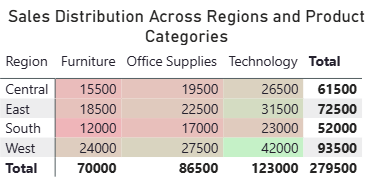
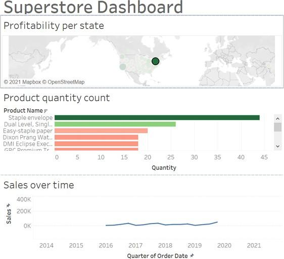
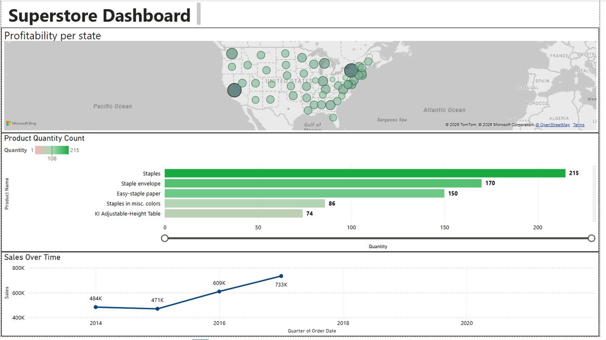

# 09 · Superstore Sales & Profit Dashboards (Power BI)

> **MAXD 5153 Big Data Analytics and Visualization · Project 1 (30%) · individual · April 2026**

## 1 · Why this project exists

The course had already taught the tools. This project tested something harder: **can you take a
flat table of sales transactions and hand a manager something they can act on by Monday?**

That is a different skill from building a chart. A chart shows what happened. A dashboard has to
answer a question someone actually asked, and point at a decision. So the project is graded in
three parts that mirror how the work really goes — build one focused visual, build a dashboard
around it, then stand up and defend it.

I treated it exactly like a stakeholder request at work, because that is where I use this every
week.

---

## 2 · The concepts behind this project

Skip this if you already know it. It is here because everything below assumes it.

### 2.1 Why colour works: pre-attentive processing

Your visual system processes certain properties — colour intensity, length, position — **before**
conscious attention kicks in, in roughly 200 milliseconds. That is why you can spot the darkest
cell in a heat map without reading a single number, but you cannot spot the largest number in a
plain table without scanning every cell.

This is the entire justification for a heat map. It is not decoration; it is offloading work from
the reader's slow reading brain onto their fast visual brain. The design consequence is strict:
**whatever colour encodes must be the thing you want people to notice.** Colour something
irrelevant and you have hijacked their fastest perceptual channel to point at noise.

### 2.2 Measures vs calculated columns — the DAX idea that trips everyone

Power BI gives you two ways to create a number, and choosing wrong is the most common beginner
mistake.

| | Calculated column | Measure |
|---|---|---|
| When it is computed | at refresh, row by row | at query time, for the current filter context |
| Where it is stored | in the table, using memory | nowhere — recomputed on demand |
| Responds to slicers | no, it is already baked in | yes, that is the whole point |
| Use it for | a row-level attribute, e.g. a category label | any aggregation, e.g. Sum of Sales |

The mental model: a **calculated column** answers "what is true about this row?", a **measure**
answers "what is true about whatever the user has currently selected?". A dashboard is made of
measures, because the user is going to click a slicer and expect the numbers to move.

### 2.3 Filter context

Every number in a Power BI visual is computed inside a **filter context** — the set of filters
that apply at that moment, coming from the row and column the cell sits in, from slicers, and
from other visuals cross-filtering it.

In the heat map, the cell at (West, Technology) shows Sum of Sales **filtered to** Region = West
and Category = Technology. Same measure, different context, different number. Once this clicks,
most confusing Power BI behaviour stops being confusing.

### 2.4 Data types, and why the import step decides everything

Power Query infers types on import, and it gets currency columns wrong constantly: `$120.00`
looks like text, so it becomes text. Every downstream aggregation on a text column then returns
blank — **silently, with no error**. You spend an hour debugging the measure when the bug is
three steps upstream in the query editor.

This generalises well past Power BI: **type errors at ingestion are the cheapest bugs to fix and
the most expensive to find later.**

### 2.5 Sales, profit, and why they are not the same question

- **Sales (revenue)** = what customers paid. A volume measure.
- **Profit** = revenue minus cost. A margin measure.
- A market can be high on one and negative on the other, and that combination is the most
  commercially interesting thing a sales dashboard can find.

The usual causes of high sales with negative profit: heavy discounting, expensive shipping modes
chosen to hit delivery promises, or a product mix skewed towards low-margin items. None of those
are fixed by selling more.

---

## 3 · The framework I worked to

Every visual on the page had to survive four questions, in this order:

| Step | The test |
|---|---|
| **Question** | What decision does someone need to make? |
| **Visual** | What is the simplest chart that answers *that* question? |
| **Number** | What are the two extremes, named with actual figures? |
| **Action** | What should change on Monday because of this? |

If a visual cannot get through all four, it comes off the page. That rule is what kept the
dashboard to three visuals instead of nine.

Why have a rule at all: dashboards rot by accretion. Every stakeholder asks for "just one more
chart", and six months later nobody can find anything. A stated admission test is how you say no
without it being personal.

## 4 · The data

The classic **Superstore** order table — one row per order line, with region, product category,
state, quantity, sales and profit. Small enough to load whole, wide enough to be genuinely
ambiguous: sales and profit pull in different directions, which turns out to be the entire story.

Source file: `data/heat_map_power_bi_dataset.csv`, loaded through Power Query.

> **The import step that decides everything.** Check the data types on import — Region and
> Product Category as text, Sales as a decimal number. Section 2.4 explains why this is not a
> nitpick.

---

## 5 · Part 1 — The heat map

### Why a heat map, and why a Matrix

The question here is *"which region-category combinations are carrying us, and which are dead
weight?"* That is a **two-dimensional comparison** — you cross one categorical axis with another
and read a magnitude at each intersection. A heat map is the natural shape for that, for the
pre-attentive reason in 2.1.

The build decision that matters: **a Matrix visual with conditional formatting, not a custom
visual from AppSource.**

1. Rows = Region, Columns = Product Category, Values = Sum of Sales
2. Conditional formatting → Background colour → by the Sales measure
3. Format: title, alignment, font size, and a colour scale tuned so high and low separate at a
   glance

A matrix with a colour scale **is** a heat map. Pulling in an external visual adds a dependency,
a licence question, and something that can break on someone else's tenant — for no gain.

One rule I hold to: **colour must encode the same measure as the number printed in the cell.**
Colour by one measure and label with another and you have built something that reads correctly
at a glance and is wrong — the worst kind of chart, because nobody checks.



*Figure 1 — The finished heat map. Regional totals: West 93,500 · East 72,500 · Central 61,500 ·
South 52,000, for 279,500 overall. Technology alone accounts for 123,000 of it. Notice that you
found the dark cell before you read this caption — that is 2.1 working.*

### Reading the extremes

| | Region | Category | Value | Why |
|---|---|---|---|---|
| Highest | West | Technology | **42,000** | darkest cell, and the largest figure in the table |
| Lowest | South | Furniture | **12,000** | lightest cell, smallest figure |

### What it actually means

Technology leads in **every single region** — 123,000 of 279,500 total sales. That matters more
than the West/Technology peak on its own, because a peak in one cell could be one big customer,
whereas leadership in every row is a **pattern**. Demand is broad, not a West-coast quirk, so
investment and marketing in Technology pays off everywhere.

The opposite corner is the warning: Furniture is the weakest category and the South the weakest
region. Where those two meet is where either the product assortment or the go-to-market is wrong,
and it is worth someone's week to find out which.

> **Generalisable habit:** read a heat map twice — once for the single darkest cell, once for
> *consistency down a row or column*. The second read is usually the more useful finding, and
> most people never do it.

---

## 6 · Part 2 — The dashboard

### Three visuals, three different questions

| Visual | Question it answers | Why this chart type | What it showed |
|---|---|---|---|
| **Map — profitability per state** | Where do we make money? | geography is the natural axis; position encodes place | California **+76,381.39** highest · Texas **−25,729.36** lowest |
| **Bar — product quantity count** | What moves? | length is the most accurate visual channel for comparing magnitudes | Staples and staple envelopes dominate — an inventory priority |
| **Line — sales over time** | Which way are we going? | a line implies continuity, which is correct for time and wrong for categories | Steady growth 2015 → 2017 |

Three visuals, three genuinely different questions. Nothing on the page repeats another visual's
job.



*Figure 2 — The dashboard page. KPI cards along the top give the headline numbers at a glance;
the trend and breakdown visuals underneath let you ask why. The layout follows the reading order
people actually use: summary first, explanation below.*



*Figure 3 — The full dashboard with slicers applied. Pick a region or a year and every visual
moves together — that is filter context (2.3) applied across a whole page. The value is that the
conversation stays on one page instead of flipping between reports.*

> **A trap worth knowing.** Bubble maps encode magnitude as **area**, and area has no sign. A
> large negative bubble reads visually as "big and good". Texas is a big *loss*, and on the map
> alone it looks like a success. That is why the profit table sits beside the map rather than
> trusting the map on its own. The general rule: **never encode a signed quantity with size
> alone** — pair it with colour, or with a table.

### The finding that matters: high sales are not high profit

California is both the highest-sales state (**457,687.63**) and the highest-profit one — no
tension there. Texas is where it breaks: big sales, **negative profit**. North Dakota is simply
the smallest market (**919.91**).

This pairing is the whole point of the exercise, and it is 2.5 made concrete. A state can be busy
and unprofitable. So the recommendation is deliberately not "sell more in Texas". It is
**"find out what we are giving away in Texas"** — because selling more of a loss-making mix makes
the problem bigger, not smaller.

---

## 7 · Part 3 — The presentation

Delivered with a written script (`PowerBI_Presentation_Script_MAXD5153.pdf` in the submission):
what the dataset is, what each visual answers, the two extremes in each visual, and the
recommendation.

The talk follows the same *question → visual → number → action* spine as the build. Using one
structure for both means you never have to invent a narrative afterwards — **the dashboard
already is the narrative.** That is a deliberate design choice, not a happy accident: if your
dashboard cannot be read out loud as a story, it is organised wrong.

---

## 8 · What I would say in an interview

- **The insight I lead with:** Technology leads in every region, and Texas sells a lot while
  losing money. Those two sentences are the whole dashboard.
- **The judgement call I defend:** three visuals, not nine. Every one earns its place by
  answering a question no other visual answers.
- **The mistake I own:** the first version leaned on the bubble map alone, and Texas read as a
  win. Adding the profit table beside it fixed a genuinely misleading page.
- **What I would add with more time:** a discount-vs-profit scatter, because that is the most
  likely explanation for Texas and the dashboard currently cannot test it.

## 9 · Technique notes worth keeping

- **Matrix + conditional formatting** is the cheapest correct heat map in Power BI.
- **Check column types at import**, before building anything (2.4).
- **Colour encodes the labelled measure.** Always (2.1).
- **Never encode a signed quantity with size alone** — bubble maps lie about negatives.
- **Measures, not calculated columns**, for anything a slicer should affect (2.2).

## 10 · How this connects to the other projects

- The imbalance lesson in [03 · E-commerce](../03-ecommerce-purchase-prediction) is the same idea
  from the modelling side: the summary number — accuracy there, total sales here — hides the
  thing that matters.
- The geospatial price-vs-occupancy pair in [04 · Airbnb](../04-airbnb-price-occupancy-knime) is
  the same "two maps that do not overlap" argument as sales vs profit here.

## Files

```text
Superstore Sales Dashboard.pbix        open with Power BI Desktop
data/heat_map_power_bi_dataset.csv     the region x category source table
figures/                               the 3 figures above, from the submission
```
