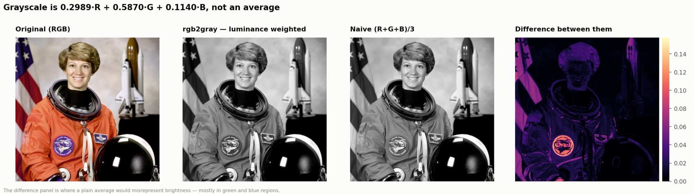
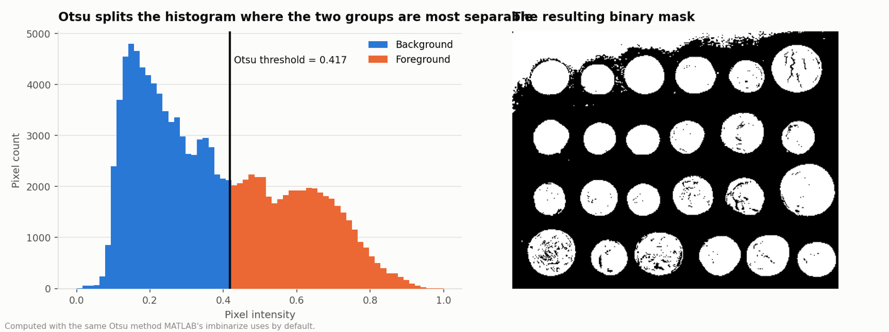
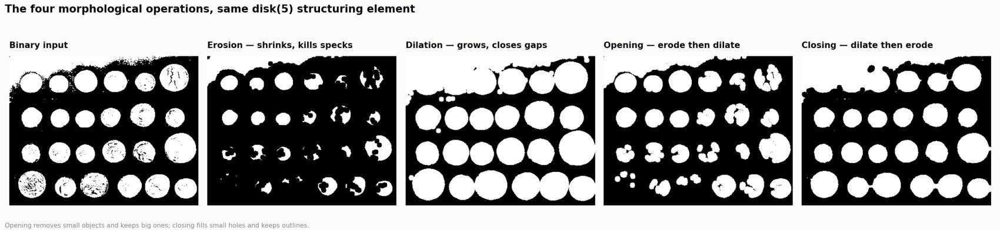
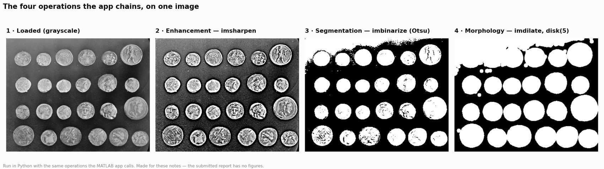

# 10 · Interactive Image Processing GUI (MATLAB)

> **MAXD 5153 Big Data Analytics and Visualization · Assignment 2 · individual · May 2026**
> `ImageProcessingGUIApplication.m` — one file, ~430 lines.

## 1 · Why this project exists

The brief: build an interactive image-processing application in MATLAB matching a given interface
— load one or more images, apply processing operations, display results, and let the user move
between images, **all without typing code**.

The real skill being tested is not the image processing. `rgb2gray` is one line. It is whether you
can build something a non-programmer can click around in **without breaking it** — which means
state management, guarded callbacks, and an interface that tells the user what is possible.

---

## 2 · The concepts behind this project

### 2.1 How a digital image is represented

An image in MATLAB is a matrix:

| Kind | Dimensions | Values |
|---|---|---|
| Grayscale | `H × W` | one intensity per pixel |
| RGB colour | `H × W × 3` | three channels: red, green, blue |
| Binary | `H × W` logical | `true` / `false` — foreground / background |

`size(img, 3)` returns the third dimension: **3 for colour, 1 for grayscale**. That single check is
what stops the most common crash in student image apps (2.6).

Pixel type matters too: `uint8` holds 0–255, `double` holds 0–1 after conversion. Mixing them
silently produces a black or white image, because a `double` image with values up to 255 is
entirely "over 1" and gets clipped.

### 2.2 Grayscale conversion is a weighted sum, not an average

```text
Y = 0.2989·R + 0.5870·G + 0.1140·B
```

Not `(R + G + B) / 3`. The weights reflect **human luminance perception** — the eye is far more
sensitive to green than to blue, so a plain average makes green objects look too dark and blue
ones too light.

Converting to grayscale before segmentation is not just about colour: it reduces three channels to
one, which is what lets a single intensity threshold mean anything.



*The weighted conversion beside a naive (R+G+B)/3, and the difference between them. The gap is not subtle — a plain average misrepresents brightness wherever green or blue dominate.*

### 2.3 Sharpening — unsharp masking

`imsharpen` uses a technique with a confusing name, inherited from darkroom photography:

1. Blur a copy of the image.
2. Subtract the blur from the original — what is left is the **edges**, since blurring is what
   removed them.
3. Add that edge image back, scaled by `Amount`.

The result is higher local contrast at edges. `'Amount', 5` is aggressive — fine for a demo where
the effect needs to be obvious, too strong for real work, where it introduces halos around edges.

**Sharpening adds no information.** It amplifies what is already there, including noise. That is
worth saying out loud, because sharpened images look more detailed than they are.

### 2.4 Segmentation and Otsu's method

**Segmentation** splits an image into meaningful regions. The simplest form is **thresholding**:
every pixel above a cut-off becomes foreground, everything else background.

The hard part is picking the cut-off. **Otsu's method** picks it automatically:

- Treat the image histogram as two classes split at threshold *t*.
- For every possible *t*, compute the variance **within** each class.
- Choose the *t* that minimises the weighted within-class variance — equivalently, maximises the
  variance **between** the two classes.

In plain terms: **find the split that makes the two groups as internally uniform and as different
from each other as possible.**

Why that matters for a GUI: it means no slider to tune. `imbinarize(gray)` adapts to each image on
its own. Otsu's weakness is that it assumes a roughly bimodal histogram — two clear peaks — and
gives a poor threshold on images with uneven lighting.



*Otsu on a real image: the histogram split at the threshold that makes the two groups as internally uniform as possible, and the mask it produces. No parameter was chosen by hand.*

### 2.5 Morphological operations

Morphology reshapes binary regions using a **structuring element** — a small shape swept over the
image.

| Operation | What it does | Use |
|---|---|---|
| **Dilation** | grows regions outward | close small gaps, thicken thin features |
| **Erosion** | shrinks regions inward | remove isolated noise pixels |
| **Opening** (erode → dilate) | removes small objects, keeps big ones | de-speckle |
| **Closing** (dilate → erode) | fills small holes, keeps outlines | repair broken edges |

`strel('disk', 5)` creates a disk of radius 5. **The shape matters:** a disk is isotropic — it
grows equally in all directions — whereas `strel('line', ...)` or `strel('square', ...)` would
favour particular directions. Real image features are rarely axis-aligned, which is why a disk is
the sensible default here.



*The four operations on the same binary input with the same disk(5). Erosion kills specks, dilation closes gaps, and opening/closing are the two orderings of that pair — each keeping a different thing.*

### 2.6 Event-driven programming, and why every callback needs a guard

A script runs top to bottom. **A GUI does not.** It sits idle until the user does something, and
then a **callback** fires. The user decides the order, and the user will click Grayscale before
loading an image.

So every callback has to defend itself:

```matlab
if currentIdx == 0, return; end     % nothing loaded
if size(img,3) == 1, return; end    % already grey
```

`rgb2gray` on an already-grey image throws an error, and an unguarded callback throws that error
straight into the user's console. **A guard clause is the difference between an app and a script
with buttons.**

### 2.7 Closures — state without globals

MATLAB **nested functions** can see and modify variables in their enclosing function's scope.
That is a closure, and it is how this app manages state.

The alternatives are both worse:

- **Globals** — any code anywhere can change them, and two instances of the app would fight.
- **`guidata` / handle-passing** — every callback has to marshal state in and out by hand.

With closures, `loadImages` writes to `images` and `convertGrayscale` reads it, with no plumbing
between them, and the state is genuinely private to one instance of the app.

### 2.8 Non-destructive editing

Keeping a second untouched copy of every image is one array, and it buys three things at once:

- **Reset** is instant, with no re-read from disk.
- **Before/after comparison** is possible at any time.
- **Undo** becomes implementable without a command history.

The general principle, and it is not specific to images: **never destroy your input.** It is the
same instinct as writing cleaned files beside the originals rather than over them.

---

## 3 · Architecture: one function, closures for state

The whole app is a single function with nested callback functions (2.7). Everything the callbacks
need — the image list, the originals, the current index, the axes handle — lives in the enclosing
scope, so there are no globals and no handle-passing.

```matlab
function ImageProcessingGUIApplication()
    images         = {};   % working copies, mutated by each operation
    originalImages = {};   % untouched copies, so Reset always works
    filenames      = {};
    currentIdx     = 0;
    ...
    function loadImages(~, ~)      % nested: sees everything above
```

The two-array split is 2.8 in code.

## 4 · Step 1 — Loading, with the multi-select detail

```matlab
function loadImages(~, ~)
    [files, path] = uigetfile( ...
        {'*.jpg;*.jpeg;*.png;*.bmp;*.tif;*.tiff;*.gif', ...
         'Image Files (*.jpg,*.png,*.bmp,*.tif,*.gif)'}, ...
        'Select one or more images', 'MultiSelect', 'on');

    if isequal(files, 0), return; end       % user pressed Cancel
    if ischar(files), files = {files}; end  % ONE file comes back as char, not cell

    images = {}; originalImages = {}; filenames = {}; currentIdx = 0;
    lblStatus.Text = 'Loading...';

    for k = 1:numel(files)
        img = imread(fullfile(path, files{k}));
        img = imresize(img, [300 300]);     % consistent working size
        images{end+1}         = img;
        originalImages{end+1} = img;        % the copy Reset restores
    end
    lblStatus.Text = 'Done loading!';
end
```

Three decisions in that block:

1. **`ischar(files)`** — with `MultiSelect` on, MATLAB returns a cell array for many files but a
   plain char row for one. Skip this line and selecting a *single* image crashes the loop. This is
   an API inconsistency, not a logic error, and the only way to know is to hit it.
2. **`imresize` to 300×300** — a 12 MP phone photo would make every operation feel broken.
   Normalising on load keeps the UI responsive. The trade-off is honest: this is a demo app, and
   the resize discards real resolution.
3. **Two arrays** — 2.8.

Also worth noting `fullfile(path, files{k})` rather than string concatenation: it produces the
right separator on any platform.

## 5 · Step 2 — The buttons, and what each one does

| Button | Operation | Implementation note |
|---|---|---|
| Load | `uigetfile` multi-select | above |
| ◀ / ▶ | browse the set | guarded by `currentIdx > 1` / `< numel(images)` |
| Grayscale | `rgb2gray` | checks `size(img,3) == 1` first and returns early if already grey (2.1) |
| Enhancement | `imsharpen(img, 'Amount', 5)` | unsharp masking (2.3) |
| Segmentation | `imbinarize(gray)` | Otsu threshold, so no manual cutoff to tune (2.4) |
| Morphology | `imdilate(bw, strel('disk', 5))` | thickens the segmented regions and closes speckle (2.5) |
| Reset | restore from `originalImages` | no re-read from disk |
| Save | `imwrite` the current result | |
| Clear | wipe the lists and the axes | resets the labels too |

```matlab
function convertGrayscale(~, ~)
    if currentIdx == 0, return; end          % nothing loaded
    img = images{currentIdx};
    if size(img,3) == 1, return; end         % already grey - rgb2gray would error
    grayImg = rgb2gray(img);
    images{currentIdx} = grayImg;            % persist, so the next op chains on it
    imshow(grayImg, 'Parent', ax);
    drawnow limitrate;                       % cap the redraw rate, keep the UI smooth
end

function doSegmentation(~, ~)
    img = images{currentIdx};
    if size(img,3) == 3, gray = rgb2gray(img); else, gray = img; end
    bw = imbinarize(gray);                   % Otsu picks the threshold from the histogram
    showResult(bw);
end

function doMorphology(~, ~)
    img = images{currentIdx};
    if size(img,3) == 3, gray = rgb2gray(img); else, gray = img; end
    bw     = imbinarize(gray);
    result = imdilate(bw, strel('disk', 5)); % disk, because features are not axis-aligned
    showResult(result);
end
```

Notice the design choice in `convertGrayscale`: it writes back to `images{currentIdx}`, so
operations **chain** — convert to grey, then sharpen the grey version. `doSegmentation` does not
write back, so it is a one-shot view. Both behaviours are defensible; what matters is that the
choice is deliberate and consistent.



*The four operations chained in the order the app runs them: load → enhance → segment → morphology. Run here in Python with the same operations the MATLAB app calls, because the submitted report has no figures.*

## 6 · Step 3 — Keeping the interface honest

`updateDisplay()` redraws the axes, sets the filename label and the "Image *n* of *N*" counter, and
writes an info line with the image's dimensions and class.

`updateButtons()` enables and disables ◀ / ▶ and every operation button based on whether anything
is loaded. **A greyed-out button is better than a callback that silently returns** — the first
tells the user why nothing happened, the second leaves them clicking and confused.

This is the part of GUI work that is invisible when done well and infuriating when skipped.

## 7 · What the assignment actually taught

- **Guard every callback** (2.6). `if currentIdx == 0, return; end` at the top of each handler is
  what stops a GUI throwing red text at a user who clicked in the wrong order.
- **Never destroy the input** (2.8). Keeping the original is one array and it buys Reset,
  before/after comparison and undo.
- **Check the image type before converting** (2.1) — `rgb2gray` on a grey image errors, and that is
  the most common crash in student image apps.
- **`drawnow limitrate`** exists because a GUI that redraws on every pixel change feels broken.
- **Disable what cannot be used.** State the interface's rules through the interface itself.

## 8 · How this connects to the other projects

- Otsu's method (2.4) is the same *idea* as choosing *k* by silhouette in
  [03 · E-commerce](../03-ecommerce-purchase-prediction): rather than picking a parameter by eye,
  define what "good separation" means numerically and let the data choose.
- The non-destructive rule in 2.8 is the same instinct as keeping the raw report PDFs untouched
  and writing extracted figures to a separate folder throughout this portfolio.

## 9 · Run it

MATLAB with the Image Processing Toolbox, then type `ImageProcessingGUIApplication` in the command
window.

## Files

```text
ImageProcessingGUIApplication.m   the whole app, one file
```
