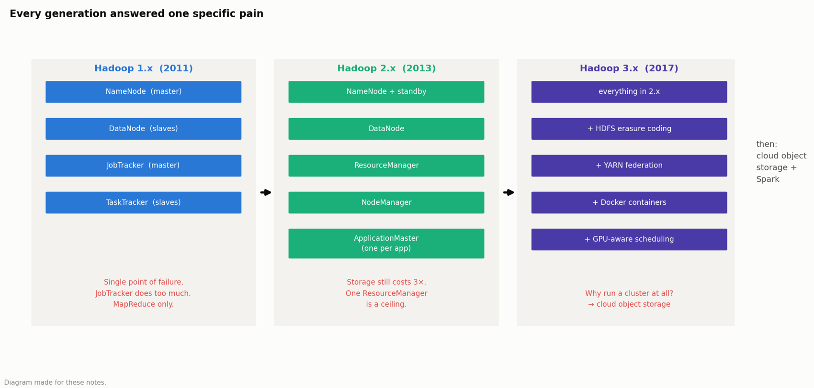
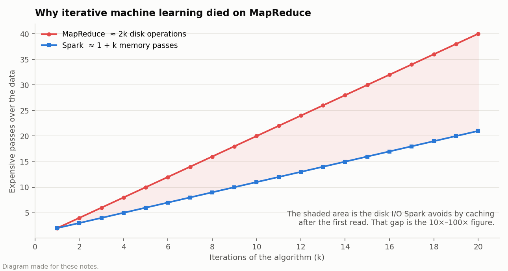
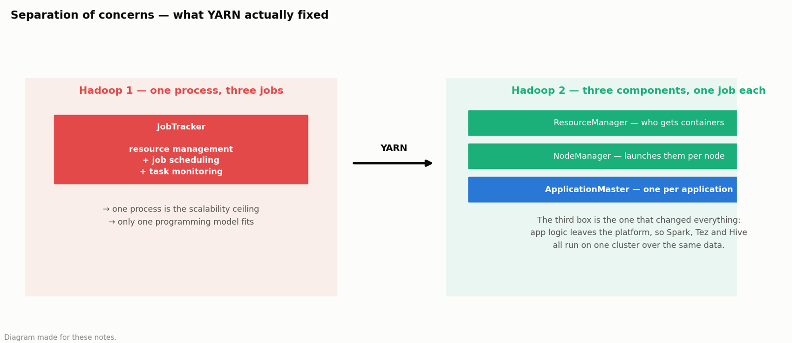
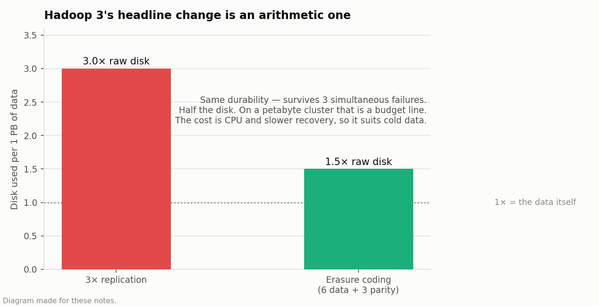

# 11 · Hadoop Ecosystem & Big Data Architecture (study notes)

> **MAXD 5123 Big Data Management · Project 2 · Group 2 · May 2026**
> Hanis binti Hussin, **Muhammad Iman Firdaus bin Md Rostan**, Norarmiza binti Arsad
> Written work, no code. Kept here because these concepts come up in every data-engineering
> interview.

## 1 · Why this project exists

The question we had to answer: **describe the evolution of Hadoop** — the architecture of each
version, the components, the limitation that forced the next version, and a real company using it
in production.

The framing matters. It is not "list the components of Hadoop", which is a memorisation exercise.
It is "explain what each generation was *for*", which means every architectural decision has to be
traced back to a problem someone actually had.

```text
Hadoop 1.x (2011)          Hadoop 2.x (2013)            Hadoop 3.x (2017)
┌──────────────────┐       ┌──────────────────┐         ┌──────────────────┐
│ NameNode         │       │ ResourceManager  │         │ + erasure coding │
│ DataNode         │  ──►  │ NodeManager      │   ──►   │ + YARN federation│
│ JobTracker       │       │ ApplicationMaster│         │ + Docker / GPU   │
│ TaskTracker      │       │ (one per app)    │         │                  │
└──────────────────┘       └──────────────────┘         └──────────────────┘
 one model: MapReduce       any engine: Spark,           same capability,
 JobTracker = bottleneck    Tez, Hive on one cluster     far cheaper storage
```

---



*The three generations side by side, each with the pain that forced the next one. Read the red text first — the architecture only makes sense as an answer to it.*

## 2 · The concepts behind these notes

### 2.1 What "big data" actually means

The usual definition is the three Vs — **Volume, Velocity, Variety** — but the useful definition is
operational: **data is "big" when it no longer fits or processes on one machine**, so you are
forced into a distributed system and everything gets harder.

That threshold moves. A dataset that needed a cluster in 2011 fits in RAM on a laptop now, which is
a large part of why the ecosystem changed so fast.

### 2.2 Scale up vs scale out

- **Scale up (vertical)** — buy a bigger machine. Simple, and there is a hard ceiling and a steep
  price curve.
- **Scale out (horizontal)** — add more cheap machines. No ceiling, but now you have a distributed
  system: partial failure, network latency, coordination.

Hadoop's founding bet was **scale out on commodity hardware**: assume machines are cheap and will
fail constantly, and handle that in software rather than paying for hardware that fails less.

### 2.3 HDFS — the distributed filesystem

**Blocks.** A file is split into large blocks (64 MB originally, 128 MB later). Large on purpose:
the block size is chosen so that seek time is small relative to transfer time, which suits
sequential scans and is terrible for small random reads.

**Replication.** Each block is stored on 3 nodes by default. That buys fault tolerance — lose a
node, the data is still there — and **data locality**, discussed next.

**Write-once, read-many.** HDFS does not support random writes into the middle of a file. That
constraint is what makes the design simple and fast for analytics, and useless as a general
filesystem.

### 2.4 Data locality — the idea Hadoop was built around

Moving a terabyte across the network is slow. Moving a few megabytes of code is not.

So Hadoop **ships the computation to the data**: the scheduler tries to run each task on a node
that already holds the block it needs. "Move the computation, not the data" is the phrase, and it
is why storage and compute lived on the same nodes for a decade.

Note that the cloud era reversed this (2.9). It is a genuine trade, not a law.

### 2.5 MapReduce

A deliberately restrictive programming model with two phases:

- **Map** — process each input record independently, emit key-value pairs. Perfectly parallel.
- **Shuffle and sort** — group all values by key and move them to the right reducer. This is the
  expensive part, and it is the network step.
- **Reduce** — process all values for one key, emit the result.

The restriction is the point: because maps are independent, the framework can schedule, retry and
parallelise them without the programmer thinking about it.

**The fatal weakness for machine learning:** every job writes its output to HDFS and every
subsequent job reads it back. An iterative algorithm doing *k* passes costs about **2k** HDFS
read/write operations. Spark, holding the data in memory, costs about **1 + k**. That difference
*is* the 10×–100× figure people quote.



*The shaded area is the disk I/O Spark avoids by caching after the first read. It widens with every iteration, which is exactly why iterative machine learning was unusable on MapReduce.*

### 2.6 Single point of failure, and why it capped Hadoop 1

The Hadoop 1 NameNode holds the entire filesystem namespace and block map **in memory, on one
machine**. Lose it and the cluster's data is unreachable — every block still physically exists,
but nothing knows where anything is.

That is a **single point of failure**: one component whose loss takes the whole system down. It is
the first thing to look for in any architecture diagram, and Hadoop 2's NameNode high availability
exists to remove it.

### 2.7 Separation of concerns — what YARN actually fixed

Hadoop 1's JobTracker did three jobs at once: **resource management**, **job scheduling** and
**task monitoring**. That is a design smell, and it produced two concrete failures — a scalability
cap (one process could not track every task in a large cluster) and a monoculture (the cluster
could run exactly one programming model).

YARN's fix is the general one: **split responsibilities into separate components.**

The `ApplicationMaster` is the piece that changes everything. Application-specific logic moves out
of the platform and into a per-job process, so the platform only has to hand out containers.
That is what lets Spark, Tez and Hive all run on one cluster over the same data.

**This is a pattern, not a Hadoop fact.** The same move — a thin generic platform plus per-workload
logic — is what Kubernetes did for services later.



*One overloaded process becomes three components with one job each. The ApplicationMaster is the row that changed the ecosystem: application logic leaves the platform, so any engine can run on the cluster.*

### 2.8 Erasure coding — the storage arithmetic

3× replication means 1 PB of data costs 3 PB of disk. **Erasure coding** stores the data plus
parity blocks computed from it, so any lost block can be reconstructed from the others.

A typical 6-data / 3-parity scheme survives three simultaneous failures with roughly **1.5×**
overhead instead of 3×. Same durability, half the disk.

The trade is CPU and recovery time: reconstructing a block means reading several others and doing
arithmetic, rather than just copying one. So erasure coding suits **cold data** — archives,
anything read rarely — while hot data stays replicated.

On a petabyte cluster this is a budget line, not a footnote, which is why it defines Hadoop 3.



*Same durability — survives three simultaneous failures — for half the disk. That arithmetic is the headline feature of Hadoop 3.*

### 2.9 Separation of storage and compute — why the cloud won

Hadoop couples them: the same nodes hold the disks and run the jobs, which is what makes data
locality possible (2.4).

Cloud object storage (S3, GCS) decouples them, and that turns out to matter more:

| | Coupled (HDFS) | Decoupled (cloud) |
|---|---|---|
| Scale storage alone | no — add nodes, get both | yes |
| Scale compute alone | no | yes |
| Cost when idle | you pay for the whole cluster | storage only |
| Data locality | yes | no — network reads |
| Operations | you run the cluster | the provider does |

Fast networks narrowed the locality penalty enough that the flexibility won. That is why the
industry moved to Snowflake, BigQuery and Databricks, and it is the honest end of the Hadoop story.

---

## 3 · Hadoop 1.x (2011) — the era of batch

**Architecture.** One master node carrying two jobs at once:

| Component | Role |
|---|---|
| **NameNode** (master) | owns the filesystem namespace and the block map — knows which DataNode holds which block |
| **DataNode** (slave) | stores the actual blocks, serves reads and writes |
| **JobTracker** (master) | schedules work, tracks progress, handles failures |
| **TaskTracker** (slave) | runs the map and reduce tasks it is given |

**Why it was built that way:** cheap commodity hardware (2.2), massive batch throughput via data
locality (2.4), and a programming model simple enough to reason about (2.5).

**What broke:**

- The **NameNode was a single point of failure** (2.6).
- The **JobTracker did too much** — scheduling, monitoring and resource management in one process,
  which capped cluster size (2.7).
- **MapReduce monoculture.** The cluster could run exactly one programming model, so anything that
  was not map-then-reduce did not belong there.

---

## 4 · Hadoop 2.x (2013) — YARN, and the split that changed everything

YARN (*Yet Another Resource Negotiator*) breaks the overloaded JobTracker into two layers:

| Component | Role |
|---|---|
| **ResourceManager** | one global scheduler: who gets containers, and how many |
| **NodeManager** | per-node agent: launches and monitors containers |
| **ApplicationMaster** | **one per application** — negotiates resources and drives *its own* job's logic |

That third row is the important one, and 2.7 explains why. Hadoop stops being a MapReduce engine
and becomes a **general-purpose distributed operating system**: a resource manager that happens to
come with a filesystem.

Hadoop 2 also added **NameNode high availability** — an active and a standby NameNode with shared
edit logs — which removes the single point of failure from 2.6.

---

## 5 · Hadoop 3.x (2017) — paying the storage bill

By now the pain was **cost, not capability**:

- **HDFS erasure coding** — 3× replication becomes ~1.5× overhead for the same durability (2.8).
- **YARN federation** — several sub-clusters behind one namespace, so scheduling scales past a
  single ResourceManager. The same "split the bottleneck" move as YARN itself, applied one level
  up.
- **Docker containers and GPU-aware scheduling** — because by 2017 the workload was deep learning,
  not just ETL, and a scheduler that cannot see GPUs cannot place a training job sensibly.

---

## 6 · What replaced what, and why

| Old | Replaced or complemented by | Reason |
|---|---|---|
| MapReduce | **Apache Spark** | in-memory: ~**1 + k** memory passes vs ~**2k** HDFS read/write operations for k iterations (2.5). That is the 10×–100× gap on iterative ML |
| Hand-written Java MapReduce | **Apache Hive** | analysts write SQL; Hive compiles it to jobs. Invented at Facebook precisely because MapReduce was too slow to *write* |
| On-prem HDFS | **cloud object storage / Snowflake** | elastic storage, no cluster to babysit, separation of storage and compute (2.9) |

The Hive row is worth dwelling on, because it is a recurring pattern: the bottleneck was **not
machine time, it was human time**. MapReduce jobs ran fine; writing them in Java took days. Hive
won by letting analysts use SQL, even though the compiled job was no faster.

## 7 · Who actually runs this

- **Facebook** — logs land in HDFS daily through Scribe; overnight **Hive** jobs aggregate them
  into the ad-analytics tables behind reach, clicks and conversions. Hive exists because their
  analysts could not wait for Java MapReduce.
- **Uber** — Spark for in-memory processing and machine learning at scale.
- **Coca-Cola** — SQL-on-big-data analytics for distribution and sales.

## 8 · The through-line I would use in an interview

Every generation answered one specific pain:

1. **Hadoop 1** → *storage and compute at scale are too expensive*
2. **YARN** → *one programming model is not enough*
3. **Hadoop 3** → *3× replication is too expensive*
4. **Spark** → *iterative ML dies on disk I/O*
5. **Cloud** → *we do not want to run the cluster at all*

**Naming components is memorisation; naming the pain each one solved is understanding.** If I can
only remember one thing from this project, it is that sentence.

## 9 · Honest scope

This was **written coursework, not production experience.** My hands-on distributed work is the
PySpark pipeline in [02 · MVTec](../02-mvtec-industrial-defect-ml) — a custom `Transformer`,
salted partitioning to avoid a skewed shuffle, and a scalability benchmark whose gap from ideal I
can explain with Amdahl's law.

Hadoop, HDFS, YARN and Hive I know at the level on this page — and I say exactly that when asked.

## 10 · How this connects to the other projects

- Section 2.5 here and section 2.1 of [02 · MVTec](../02-mvtec-industrial-defect-ml) are the same
  argument from the two ends: this page explains why MapReduce's disk round-trips are fatal for
  iteration, and MVTec measures what Spark actually delivers instead (1.97×, not the advertised
  figure).
- The "split the overloaded component" pattern in 2.7 is the same instinct as separating
  `WarehouseEnv` / `QNet` / `DQNAgent` in MVTec, or `src/` from `run.py` in
  [01 · Flood segmentation](../01-flood-segmentation-kd). Different scale, same idea.

## Files

No code — this is written coursework. The submitted report is not published here.
